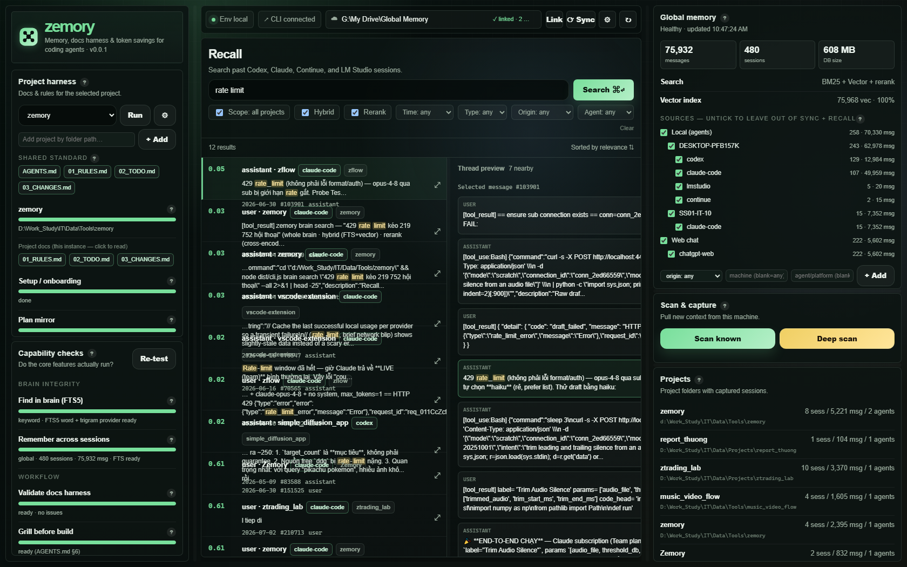

<div align="center">

# zemory

**Local context & memory governance for coding agents — one daemon, one SQLite memory, one docs harness.**

Zemory captures every coding‑agent session into a single local memory, gives each
project a self‑healing docs harness, derives a code/docs graph on demand, and lets
you recall anything across tools, projects, and machines — all offline, with **no
model API calls**.




</div>

---

## Table of contents

- [Why zemory](#why-zemory)
- [Highlights](#highlights)
- [Quickstart](#quickstart)
- [The cockpit (daemon UI)](#the-cockpit-daemon-ui)
- [Core concepts](#core-concepts)
- [The graph](#the-graph)
- [CLI reference](#cli-reference)
- [Web‑chat capture](#web-chat-capture)
- [Scoped sync & recall](#scoped-sync--recall)
- [Cross‑machine sync](#cross-machine-sync)
- [Privacy & retention](#privacy--retention)
- [For agents — the harness & standard](#for-agents--the-harness--standard)
- [Repository structure](#repository-structure)
- [Development](#development)
- [Architecture & safety model (constitution)](#architecture--safety-model-constitution)
- [Roadmap](#roadmap)
- [Acknowledgements](#acknowledgements)
- [License](#license)

---

## Why zemory

Coding agents (Claude Code, Codex, Continue, LM Studio, and web chats like
ChatGPT) each keep their own memory in their own place. Across a week you lose
track of *what you decided, why a fix worked, or where a session ran* — and every
project's rules/TODO/changelog quietly drift out of sync with the code.

Zemory fixes both halves:

- **One Global Memory.** Every agent session on your machine is ingested into a
  single local SQLite database you can search by keyword or meaning — across
  every project and machine.
- **One per‑project harness.** A small, standard set of docs (constitution,
  rules, structure, skills, TODO, changelog, numbered plans) that the working
  agent keeps aligned with the code.

It is **local‑only** and **never calls a model API** — the "intelligence" is the
agent already driving your terminal; zemory gives it durable memory and a
disciplined workspace. Embedding and reranking run as small local ONNX models
that only *score* text; they never *generate* it.

---

## Highlights

| | |
|---|---|
| 🧠 **Global Memory** | Every Claude / Codex / Continue / LM Studio session in one local SQLite DB, deduped, secret‑redacted, digested. |
| 🔎 **Hybrid recall** | FTS5 keyword (word **+ trigram**, so substrings & non‑Latin work) fused with a local vector index (EmbeddingGemma via Transformers.js — no Python/GPU) via RRF, with optional cross‑encoder rerank. Every stage **fails open** to FTS. |
| 🌐 **Web‑chat capture** | Pull your **ChatGPT web** history into the memory via a login‑once browser window — no password ever touches zemory. |
| 🧭 **Provenance lanes** | Every session is stamped with `origin` (local/web), `host` (machine), and `source` (agent) — one column, not a second store. Filter, roll up, and **exclude** lanes. |
| 🪪 **Project harness** | A shared standard (`docs_template/`) the agent adapts into each project: constitution ↔ rules ↔ structure ↔ TODO ↔ changelog ↔ numbered plans, kept in sync. `.md` is the source (file wins); the DB is a derived index. |
| 🕸️ **Code & docs graph** | On‑demand import graph (TS/JS + Python), tree‑sitter symbols, `graph impact` (blast radius), `graph fitness`, `graph export --json`. A **derived** layer — declared vs inferred edges never mix. |
| 🖥️ **Background daemon** | A single instance on fixed port **4444** that opens in a **native app window with its own taskbar icon** (falls back to an Edge app window), a system‑tray icon, optional start‑with‑OS, an idle scheduler (scan → embed → digest), and a write‑gate that serializes DB writes. |
| 🔐 **Cross‑machine sync** | Merge machines through an **encrypted delta bundle** on a Drive folder — additive, never destructive, provenance preserved. |
| 🔌 **MCP server** | Expose recall to any MCP client (`memory_search`, `memory_show`, `plan_search`, `plan_show`). |
| 🕵️ **Privacy tools** | Forget, re‑redact, back up, and restore — all local, dry‑run by default, backed up before deleting. |

---

## Quickstart

**Requirements:** Node **≥ 20** and a C/C++ toolchain for the native `better-sqlite3`
build (Xcode CLT on macOS · `build-essential` on Linux · MSVC Build Tools on
Windows). The embedding/rerank models download automatically on first `memory embed`
(cached under `~/.zemory/models`, never committed). On Windows the cockpit uses the
system **WebView2** runtime for its native window and falls back to an Edge app
window if it is absent. No GPU, no Python, no network at runtime beyond the one‑time
model fetch.

Zemory is installed **once per machine** and shared by every project. It is not on
a public npm registry yet — install from this repo (native install; the workstation
profile is native, not Docker):

```bash
git clone <this-repo>
cd zemory
npm ci
npm run build
npm install -g .          # exposes the global `zemory` command (or: npm link)

zemory memory scan         # ingest existing agent transcripts on this machine
zemory hook install       # auto-capture new Claude/Codex sessions (0 tokens)
zemory memory embed --all  # build the semantic vector index (enables hybrid recall)
zemory doctor             # verify everything is green
```

Because `npm install -g .` links the repo, a later `npm run build` updates the
global `zemory` command in place — no reinstall needed.

**Add a docs harness to a project (optional):**

```bash
cd your-project
zemory init && zemory doctor
```

Any project can query the shared memory even with no harness; `zemory init` only
adds the curated constitution/rules/structure/TODO/changelog/plan docs.

---

## The cockpit (daemon UI)

```bash
zemory ui
```

Starts (or attaches to) the background daemon on `http://127.0.0.1:4444` and opens
a **native app window** that carries its own taskbar icon (falling back to an Edge
app window where WebView2 is unavailable). It is **single‑instance** — a second
`zemory ui` focuses the running window instead of spawning a duplicate — and adds a
system‑tray icon (Open / Quit). Override the port with `ZEMORY_UI_PORT` when 4444
clashes.

The cockpit has a top tab bar:

- **🧠 Global Memory** — machine‑wide, split into two sub‑tabs:
  - **Recall & shared standard** — search past sessions (Hybrid / Rerank toggles;
    filter by time, role, origin Local/Web, and agent; inline thread preview), next
    to the **shared standard** (`docs_template/`) every project inherits.
  - **Memory & sync** — memory totals, a **Sources tree** (Local → machine → agent,
    Web → platform) where you **untick a lane to leave it out of sync + recall**,
    scan, capture coverage, and cross‑machine **Sync**. The **Projects** list groups
    every project by machine; each linked project has a **📌 pin** (keep it on the
    tab bar) and an **✕ remove** (drop it from the picker — the folder, its docs and
    its memory are untouched), plus a **prune** button that clears dead entries.
- **Per‑project tabs** — each project you add is its own tab with two sub‑tabs:
  **Harness** (its docs status, validation, capability checks) and **Graph** (the
  folder‑structure tree + the live code graph).
- **⚙ Settings** — language, storage location, automation (start‑with‑OS, auto
  vector, auto sync), and search defaults.

Two themes (dark, default · light monochrome) toggle from the tab bar. Any panel
region with two or more adjacent panels has a **drag‑to‑resize** seam; sizes are
persisted in `~/.zemory/config.json` and restored on reopen. The markdown docs are
the **source** — edit the `.md` directly (file wins); the DB is a derived search
index rebuilt from those files.

---

## Core concepts

### Global Memory

One SQLite database at `~/.zemory/global_memory.db` (its location is a fixed
pointer at `~/.zemory/location.json`; move it off the system drive with
`zemory memory relocate` / the cockpit's "Storage" pane). `zemory memory scan`
ingests agent transcripts incrementally and idempotently; the Stop hooks keep it
current with zero extra tokens. Messages are deduped, secret‑redacted, and
summarized into per‑session digests for cheap recall. **Never** put the live DB in
a cloud‑synced folder — a WAL database synced by a cloud client corrupts.

### Provenance & origin

Every session carries `origin` (`local` = agent transcripts on disk, `web` =
captured web chat), `host` (the producing machine), and `source` (the tool). This
is what powers filtering, per‑machine rollups, and scoped sync — with **one
column, not a second store**. Scope selectors only *filter*; they never rewrite or
merge a session's provenance.

### Recall (hybrid)

Recall fuses two FTS5 streams (word + trigram) with a local vector stream via
Reciprocal Rank Fusion, blended with a recency signal. Cross‑encoder rerank is
opt‑in. Every added stage **fails open** — if the model is unavailable, recall
degrades to keyword FTS instead of breaking. FTS5 is always the baseline; the
semantic layer only *adds*.

### The harness (standard + per‑project)

`docs_template/` is the **shared, generic standard** shipped with zemory — the
canonical rules and the *method* for storing them. Installing the harness into a
project is not a blind copy: zemory scaffolds the **structure**, and the working
agent reads the standard and **adapts it to the project** (gather & number plans,
keep constitution ↔ rules ↔ structure ↔ TODO ↔ changelog ↔ plan in sync).
Project‑specific content (TODO, changelog) is never copied from another project.

---

## The graph

Zemory builds a **derived** graph over your repo — rebuildable from `.md` + code +
memory at any time, with **0 LLM** calls. Two edge classes never mix: **declared**
(deterministic — imports, doc references, supersede markers, `session_digest`
touches) and **inferred** (fail‑open overlay — cosine `semantic_neighbor`, name‑matched
`calls` with an honest `inferred`/`textual` confidence, never self‑promoted to
"resolved"). It is an internal engine of the memory domain, not a fifth capability;
external tools consume the versioned `graph export`, they do not re‑parse the standard.

```bash
zemory graph impact <file>     # blast radius: who imports this (direct + transitive), hub flag, touched-by
zemory graph callers <symbol>  # call sites of a function / Class.method, with confidence
zemory graph fitness [--gate]  # hub% · isolated% · util-purity (exit 1 on fail → CI-able)
zemory graph export --json     # contract v2: nodes(+symbols+touchedBy) · edges · orphans · fitness
```

In the cockpit, the **Graph** sub‑tab lights up imports and folder‑tree nodes together
(two‑way), sizes nodes by fan‑in, and colors by structural slot.

---

## CLI reference

```text
# Memory
zemory memory scan [--deep]              Ingest agent transcripts (deep = walk the disk)
zemory memory scan-web [--limit N]       Capture ChatGPT web chat (login-once browser)
zemory memory search "q" [--all]         Recall (this project | everywhere)
zemory memory search "q" --rerank        Recall with cross-encoder rerank
zemory memory embed --all                Build/refresh the semantic vector index
zemory memory scope [exclude|include]    Provenance tree; exclude a lane from sync+recall
zemory memory hosts                      Sessions by machine -> agent -> project
zemory memory digest <session>           Show a session's summary digest
zemory memory sync --dir <folder>        Cross-machine sync via a Drive folder (delta)
zemory memory export / import [--merge]  Encrypted bundle out / in (merge = additive)
zemory memory forget / redact            Privacy: forget rows / re-apply redaction
zemory memory backup / restore           Raw local SQLite backup / restore
zemory memory relocate <dir>             Move the live DB off the system drive

# Graph (derived, 0 LLM)
zemory graph impact <file>              Blast radius for a change
zemory graph callers <symbol>           Call sites of a symbol (confidence-labeled)
zemory graph fitness [--gate]           Structural fitness metrics (+ CI gate)
zemory graph export [--json] [--out f]  Versioned graph contract for external tools

# Harness & docs (.md is the source; DB = derived index)
zemory init | sync                      Scaffold / gap-fill the project harness
zemory structure                        Print the repo structure standard (+ routing)
zemory validate                         Lint the docs harness (links, length, supersede)
zemory doctor                           Verify docs, providers, capabilities
zemory plan ls | search | show          Search project specs
zemory changelog ls | search            Search the changelog
zemory reindex                          Rebuild the docs search index from .md (read-only)
zemory archive                          Trim an over-long changelog into the DB history

# Interfaces
zemory ui                               Background daemon + cockpit (port 4444, single-instance)
zemory mcp                              MCP stdio server for recall tools
zemory hook install                     Install the 0-token Stop-capture hook
```

---

## Web‑chat capture

Web chats (ChatGPT, later Gemini / Claude.ai) live on the server — there is no
file on disk for `memory scan` to read. Zemory captures them with a
**browser‑connector**:

```bash
zemory memory scan-web                    # opens a login-once window; log in ONCE
zemory memory scan-web                    # re-run: pulls + ingests (origin=web)
zemory memory scan-web --limit 5          # pull just the newest 5 (quick verify)
```

Zemory opens a dedicated browser profile (`~/.zemory/browser/chatgpt`), you log
in on the real site (id/password/2FA go to OpenAI, **never** to zemory), and
zemory drives that logged‑in tab over CDP to read the site's own conversation API
— running inside the real browser so it passes Cloudflare. Pulls are **batched
and resume‑safe** and paced to ease rate limits. Captured chats land in the same
memory under `origin=web` and are fully searchable.

> ⚠️ Captured conversation files contain real personal data and are **never
> committed** — only code and docs live in this repo.

---

## Scoped sync & recall

Some lanes are shared or noisy and you don't want them in your personal memory's
sync or recall. Tick them off in the cockpit's **Sources** tree, add a rule for
lanes not captured yet, or use the CLI:

```bash
zemory memory scope                        # show the Local/Web x machine x agent tree
zemory memory scope exclude --source codex # leave codex out of sync + recall
zemory memory scope exclude --origin web   # leave all web chat out
zemory memory scope include --source codex # undo
```

Exclusion is a **filter, not a delete** — the data stays in the local DB; it is
simply left out of exported bundles, incoming merges, and recall results.

---

## Cross‑machine sync

Each machine keeps its own local `global_memory.db`. To share, sync an
**encrypted bundle** through a cloud‑Drive folder — never put the live SQLite file
in a synced folder.

```bash
# one-time: a LOCAL Drive path (Google Drive/OneDrive) + the same share/share.key on each machine
zemory memory sync --dir "G:\My Drive\Global Memory"
zemory memory embed --all                 # vectorize newly merged messages
```

`memory sync` exports this machine's changes as a **delta bundle** (a baseline +
incremental deltas keyed by a watermark, compacted when the series grows) and
merges every other machine's bundles it finds. Merge is **additive**: nothing is
overwritten, each session keeps the `host` that produced it (see `zemory memory
hosts`), and re‑merging the same bundle adds zero. The memory itself never lives in
git — a fresh clone starts empty; populate it with `scan` + `sync`.

---

## Privacy & retention

```text
zemory memory backup [out.db]             Raw local SQLite backup
zemory memory restore <backup.db> --force Restore a raw backup (renames the old DB aside)
zemory memory forget --project .          Dry-run forget for the current project
zemory memory forget --session <id> --force
zemory memory redact --force              Re-apply secret redaction to old rows
```

`forget` is a dry‑run unless `--force`, and always backs up before deleting. It
removes rows from zemory's derived memory + vector index; it does not delete the
agent's original transcript files. Anyone who can read the share key can decrypt
the bundles.

---

## For agents — the harness & standard

If you are an agent working **in a project that uses zemory**, read the harness in
order: `AGENTS.md` (the thin router at the repo root) → `docs/agent/01_CONSTITUTION.md`
(architectural invariants, supreme) → `02_RULES.md` (work rules) → `03_STRUCTURE.md`
(folder standard + routing) → `04_SKILLS.md` (playbooks) → `05_TODO.md` → `06_CHANGES.md`.
Everything you need is in `docs/` — `AGENTS.md` only points the way.

If you are an agent working **in *this* repo (zemory itself)**: it is the canonical
source other repos copy from. Read `docs_template/` (the blank standard) and apply
it **in your own repo** — do not write here or run `zemory` with this as the cwd
unless the user explicitly allows it (another session may be working here).

Recall from other sessions on demand — do not guess:

```bash
zemory memory search "<what a past session decided>" --all
```

---

## Repository structure

Zemory follows the same standard it ships (`docs/agent/03_STRUCTURE.md`). Four
roles are required — `backend/` (code), `frontend/` (UI), `docs/` (harness),
`AGENTS.md` (entry) — and code is arranged **domain‑first**:

```text
backend/                server-side: 100% first-party code + thin entry surfaces
  src/
    memory/              the memory domain: store · ingest/search/digest · embed/rerank · graph engine · io
    docs/               the harness domain: plan · changelog · markdown · adopt/validate services
    core/               composition root: registry · router · runtime (wiring, no business logic)
    modules/            capability providers (memory · search · harness · health)
    config/ · i18n/     cross-cutting (settings, localization)
    commands/           one file per CLI verb (thin — wire into a domain)
    platform/           OS integration: tray icon · start-with-OS
    jobs/               background: scheduler · write-gate · sync runner
  resources/            bundled tracked assets (packaging icons, seeds)
  test/                 tests for logic that can silently break
frontend/               the UI (served static by the daemon, no bundler):
  pages/ · styles/ · components/ · scripts/ · assets/
docs/                   this project's own harness (agent/ + numbered plan/)
docs_template/          the BLANK generic standard other repos copy — app/ + nonapp/ (two profiles)
external/skills/         vendored third-party skills (kept verbatim, indexed in 04_SKILLS)
AGENTS.md               thin router into docs/
```

> Runtime data, secrets, and build output (`data/`, `.env`, `dist/`) are
> gitignored; encrypted sync bundles live under `share/` (git‑LFS, already
> encrypted). Non‑app deliverable projects (BI/report, data, docs‑only) follow
> `03_STRUCTURE §7` instead — `docs/` + `AGENTS.md` + a deliverable folder, no
> `backend/`/`frontend/`.

---

## Development

```bash
npm ci
npm run check         # strict typecheck + lint + tests (temp SQLite DBs)
npm pack --dry-run
```

- `backend/src/` is 100% first‑party code; external libs/models are called or
  vendored under `external/`, never pasted into `backend/`.
- Docs: the `.md` file is the source (file wins); the DB is a derived search
  index, droppable and rebuildable via `zemory reindex`.
- UI strings go through i18n with both a VI and an EN entry (no hardcoded
  user‑facing strings); technical terms (Recall, Hybrid, FTS5, vector, embed…)
  are kept, not translated. Code and public comments are English.
- Tests run against throwaway databases; no network anywhere.

---

## Architecture & safety model (constitution)

The binding invariants live in `docs/agent/01_CONSTITUTION.md`; a violation is a
design bug even when the code runs. In brief:

1. **Save tokens above all** — prefer calling/extending the best existing tool over
   rewriting it; a rule serves the goal, not the reverse.
2. **First‑party vs third‑party** — `backend/src/` is 100% yours; external engines
   are dependencies/adapters (or `external/`), never pasted in. Model weights are
   fetched at runtime, not committed.
3. **One source per layer; every index is derived.** Curated docs: the `.md` is the
   source (file wins), the DB is a rebuildable index. Episodic: the host transcript
   is the source, `sessions`/`messages`/FTS/vector/digest are derived — never edit
   the originals; no second store, no auto‑summary as a source.
4. **One capability = one slot = one provider** (the registry rejects conflicts;
   vector/rerank are internal engines of `search`, not new slots).
5. **Tool is separate from project data.** Installed machine‑wide; reads a project's
   docs. Root needs only `AGENTS.md`; config lives in `docs/.harness.json`.
6. **Never calls an LLM / no model proxy.** No `ANTHROPIC_BASE_URL`, no history
   rewrite, no text generation. Local embed/rerank only *score*, never *generate*.
7. **Local‑only + privacy by default.** Data stays on the machine; the only thing
   that leaves is a user‑initiated **encrypted** bundle. Credentials are redacted at
   ingest; web passwords/2FA never enter zemory. No real data/PII in git.
8. **Recall on demand + progressive disclosure — no auto‑inject.**
9. **Fail‑open at every optional layer.** Vector/rerank/digest/graph missing →
   recall degrades to FTS/heuristic, never dies.
10. **Mechanical capture, 0 tokens, no host over‑reach.** Hooks read transcript
    files incrementally; they never call a model or bypass host permissions.
11. **Cross‑machine sync is additive; provenance never mixes.** Merge only adds; the
    live DB never lives in a cloud‑synced folder.
12. **Honest measurement + a gate before defaults.** No counterfactual numbers; a new
    layer ships as default only after benchmark + tests + safe migration + fallback.
13. **The graph is a derived layer; declared and inferred edges never mix.** Rebuilt
    deterministically from `.md` + code + memory (0 LLM); inferred edges are labeled
    and never masquerade as declared. External consumers read only the versioned export.

---

## Roadmap

- Full‑account ChatGPT backfill acceptance on a live account (pacing + resume).
- Gemini and Claude.ai web capture behind the same browser‑connector.
- Scoped exclusion at ingest time (`scan` / `scan-web`), not just sync + recall.
- Extending semantic retrieval beyond agent memory to first‑party data/knowledge.
- Deeper graph resolution (tsserver/pyright `resolved` edges) once real usage
  justifies it; MCP `graph_neighbors` / `graph_impact` mirrors.
- Optional sync of file/image attachments (opt‑in, off the git bundle lane).

---

## Acknowledgements

Zemory is first‑party code that stands on a small, carefully‑licensed stack — every
dependency is Apache‑2.0‑compatible and called through an adapter, never pasted into
`backend/` (constitution §2):

| Layer | Project | License |
|---|---|---|
| Storage | [better‑sqlite3](https://github.com/WiseLibs/better-sqlite3) · [sqlite‑vec](https://github.com/asg017/sqlite-vec) | MIT · Apache‑2.0/MIT |
| Embeddings / rerank | [🤗 Transformers.js](https://github.com/huggingface/transformers.js), [EmbeddingGemma](https://huggingface.co/google/embeddinggemma-300m) (Gemma terms), [BGE reranker](https://huggingface.co/BAAI/bge-reranker-base) | Apache‑2.0 · Gemma · MIT |
| Code graph | [tree‑sitter](https://github.com/tree-sitter/tree-sitter) (`web-tree-sitter`, `tree-sitter-wasms`) | MIT |
| Desktop shell | [@nativewindow/webview](https://www.npmjs.com/package/@nativewindow/webview) (wry/tao) · [systray2](https://github.com/felixhao28/node-systray) · [koffi](https://github.com/Koromix/koffi) | MIT |

Model weights are fetched and cached at runtime — **never committed** — and every
vendored third‑party skill under `external/skills/` keeps its original `LICENSE`.

---

## License

Licensed under the **Apache License 2.0** — see [LICENSE](LICENSE).

```
Copyright 2026 Nguyen Duc Huy (zemory contributors)

Licensed under the Apache License, Version 2.0 (the "License");
you may not use this file except in compliance with the License.
You may obtain a copy of the License at

    http://www.apache.org/licenses/LICENSE-2.0
```

<div align="center">
<sub>Built for agents that should remember. Local‑first, no model API, one memory.</sub>
</div>
