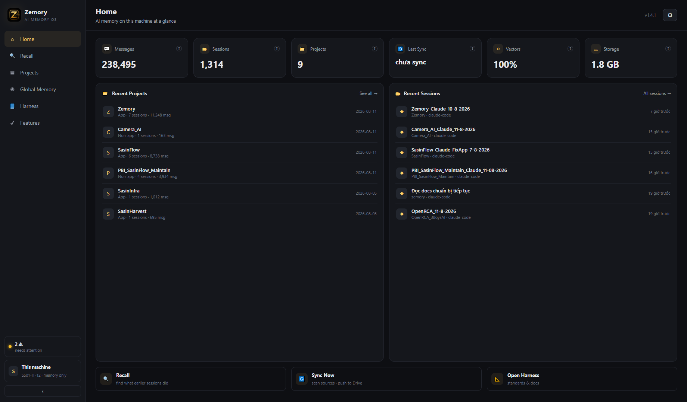
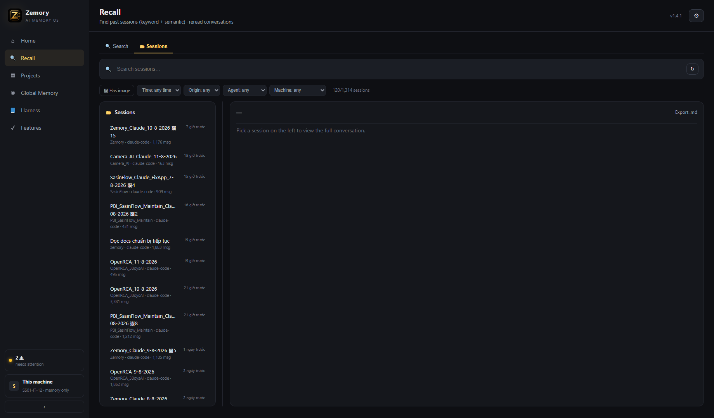
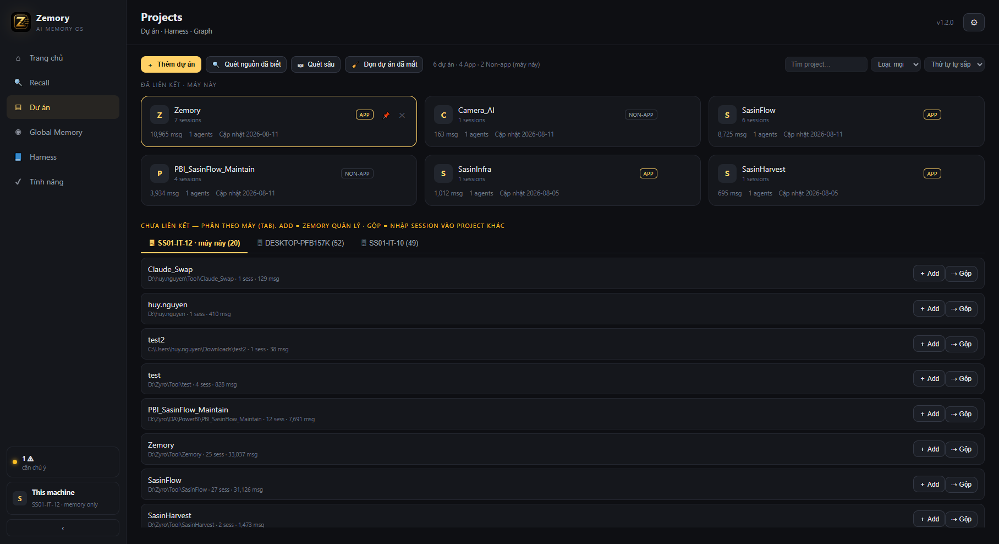
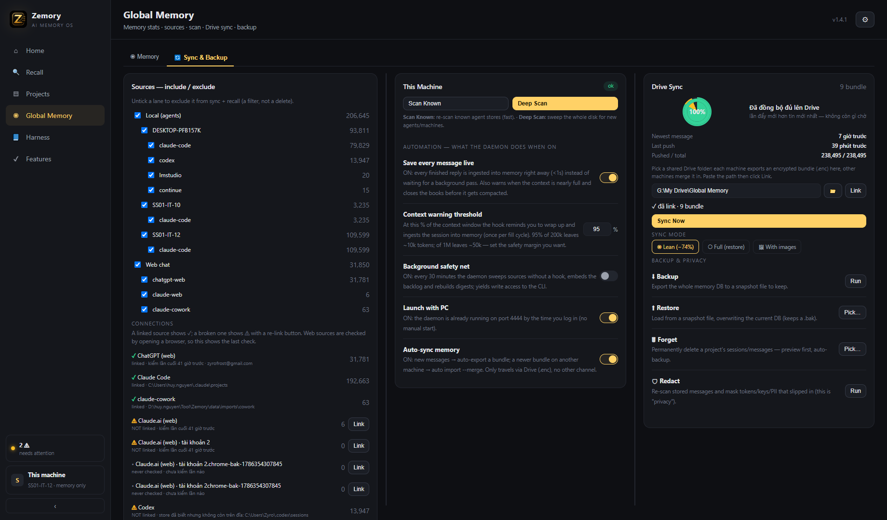
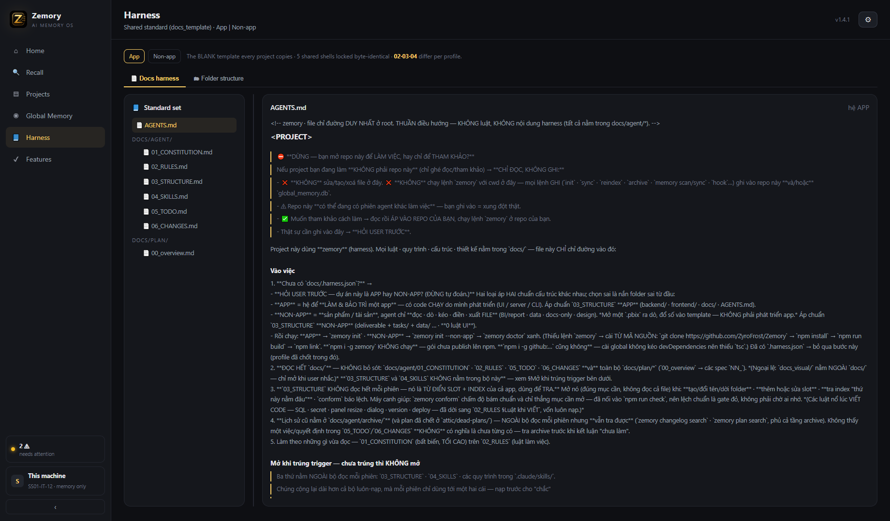
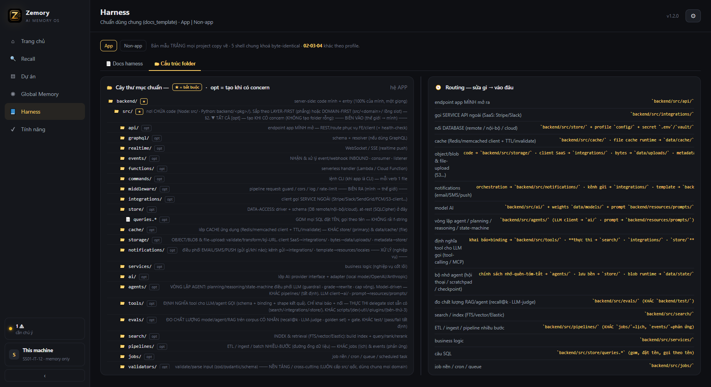
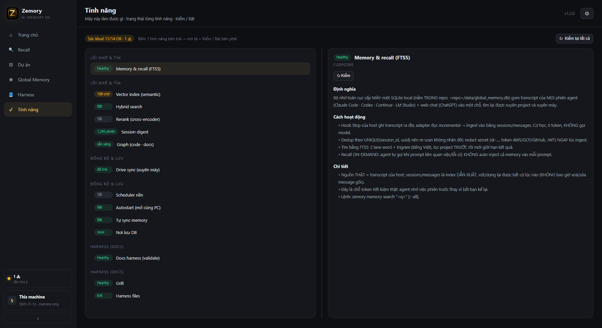

<div align="center">

# zemory

**A project harness for building apps of any kind — plus a local, cross‑session memory for the agents that build them.**

Zemory gives every project a **standard docs + architecture harness** — a ~40‑slot
structure standard that scaffolds *any* app (web, CLI, desktop, **and AI/LLM apps**,
with first‑class `ai/` · `agents/` · `tools/` · `evals/` slots) — **and** a single
local memory that captures every coding‑agent session so you can recall anything
across tools, projects, and machines, offline.

> **What agents most often misread:** zemory's *own* global‑memory engine never calls
> an LLM — it only *scores/embeds* text with local models. That is a fact about
> zemory's internals, **not** an anti‑LLM philosophy and **not** a constraint on the
> apps you build with the harness. **Scaffolding LLM/AI apps is a first‑class use of
> the harness.** Use the harness alone, the memory alone, or both.




**Six screens, captured from a running instance** — [full tour with commentary below ↓](#the-cockpit--a-screen-by-screen-tour)

| | | |
|:--:|:--:|:--:|
| [](#1--home--the-at-a-glance-row)<br>**1 · Home** — six tiles, recent projects & sessions | [](#2--recall--find-the-session-then-read-it)<br>**2 · Recall** — filter, pick a session, read the thread | [](#3--projects--linked-vs-discovered)<br>**3 · Projects** — linked cards vs discovered-by-machine |
| [](#4--global-memory--the-numbers-and-the-two-ways-data-moves)<br>**4 · Global Memory** — sources, automation, Drive sync | [](#5--harness--the-shared-standard-readable-in-the-app)<br>**5 · Harness › Docs** — the shared standard, App \| Non-app | [](#5--harness--the-shared-standard-readable-in-the-app)<br>**6 · Harness › Structure** — slot tree + routing table |
| [](#6--features--what-this-machine-can-actually-do)<br>**7 · Features** — 14 capabilities, each re-checkable | | |

</div>

---

## Table of contents

- [Why zemory](#why-zemory)
- [Highlights](#highlights)
- [Quickstart](#quickstart)
- [The cockpit — a screen-by-screen tour](#the-cockpit--a-screen-by-screen-tour)
- [Core concepts](#core-concepts)
- [Guardrails (layer-1 machine locks)](#guardrails-layer-1-machine-locks)
- [The graph](#the-graph)
- [CLI reference](#cli-reference)
- [Web‑chat capture](#web-chat-capture)
- [Scoped sync & recall](#scoped-sync--recall)
- [Cross‑machine sync](#cross-machine-sync)
- [Privacy & retention](#privacy--retention)
- [For agents — the harness & standard](#for-agents--the-harness--standard)
- [Repository structure](#repository-structure)
- [Development](#development)
- [Architecture & safety model (constitution)](#architecture--safety-model-constitution)
- [Roadmap](#roadmap)
- [Acknowledgements](#acknowledgements)
- [License](#license)

---

## Why zemory

Coding agents (Claude Code, Codex, Continue, LM Studio, and web chats like
ChatGPT) each keep their own memory in their own place. Across a week you lose
track of *what you decided, why a fix worked, or where a session ran* — and every
project's rules/TODO/changelog quietly drift out of sync with the code.

Zemory is **two independent tools** you can use separately or together:

- **A per‑project harness (the default — no database needed).** A standard set of
  docs (constitution, rules, **structure**, skills, TODO, changelog, numbered plans)
  plus a **~40‑slot folder standard** that scaffolds *any* app and keeps the agent's
  work aligned with the code. The structure standard covers every concern of a modern
  app — API, store, jobs, auth, i18n, UI — **including the slots for building AI/LLM
  apps**: `ai/` (model provider), `agents/` (agent loop / planning), `tools/`
  (LLM tool‑calling), `evals/` (quality gates). The same harness scaffolds a CRUD
  service or an LLM agent app.
- **A Global Memory (optional).** Every agent session on your machine ingested into a
  single local SQLite database you can search by keyword or meaning — across every
  project and machine.

**About "never calls a model API".** This is a rule for zemory's *own* global‑memory
engine: it *scores/embeds* text with small local ONNX models; it never *generates*
text and never proxies a model API. It says **nothing** about the apps you build with
the harness — those can be as LLM‑centric as you want. The "intelligence" is the agent
already driving your terminal; zemory gives it durable memory and a disciplined,
standard workspace.

---

## Highlights

| | |
|---|---|
| 🏗️ **App harness & standard** | A ~40‑slot architecture standard + curated docs (constitution ↔ rules ↔ structure ↔ skills ↔ TODO ↔ changelog ↔ numbered plans) that scaffolds *any* app — from a CRUD service to an **LLM agent app** (`ai/` · `agents/` · `tools/` · `evals/` slots). `.md` is the source (file wins); the DB is a derived index. |
| 🧠 **Global Memory** | Every Claude / Codex / Continue / LM Studio session in one local SQLite DB, deduped, secret‑redacted, digested. |
| 🔎 **Hybrid recall** | FTS5 keyword (word **+ trigram**, so substrings & non‑Latin work) fused with a local vector index (EmbeddingGemma via Transformers.js — no Python/GPU) via RRF, with optional cross‑encoder rerank. Every stage **fails open** to FTS. |
| 🌐 **Web‑chat capture** | Pull your **ChatGPT web** history into the memory via a login‑once browser window — no password ever touches zemory. |
| 🧭 **Provenance lanes** | Every session is stamped with `origin` (local/web), `host` (machine), and `source` (agent) — one column, not a second store. Filter, roll up, and **exclude** lanes. |
| 🕸️ **Code & docs graph** | On‑demand import graph (TS/JS + Python), tree‑sitter symbols, `graph impact` (blast radius), `graph fitness`, `graph export --json`. A **derived** layer — declared vs inferred edges never mix. |
| 🖥️ **Background daemon** | A single instance on fixed port **4444** that opens in a **native app window with its own taskbar icon** (falls back to an Edge app window), a system‑tray icon, optional start‑with‑OS, an idle scheduler (scan → embed → digest), and a write‑gate that serializes DB writes. |
| 🔐 **Cross‑machine sync** | Merge machines through an **encrypted delta bundle** on a Drive folder — additive, never destructive, provenance preserved. |
| 🔌 **MCP server** | Expose recall to any MCP client (`memory_search`, `memory_show`, `plan_search`, `plan_show`). |
| 🕵️ **Privacy tools** | Forget, re‑redact, back up, and restore — all local, dry‑run by default, backed up before deleting. |
| 🛡️ **Layer‑1 guardrails** | `zemory hook guard` generates real machine locks (PreToolUse + pre‑commit) from your `protected` / `secretNames` markers: recursive & mass deletes, discarding uncommitted work, secrets reaching a commit, overwriting a file that has content. One‑shot `.allow-*` flags, self‑consuming. **A safety net for when the agent forgets a rule — not permission to skip asking you.** |
| 📐 **Gates, not promises** | `conform` (standard drift) · `validate` (docs) · `todo verify` (re‑measures every backlog item against the code) · `graph fitness --gate` · a 10‑dimension audit playbook. The repo's own doctrine: *what stops drift is code, not a rule someone must remember.* |

---

## Quickstart

**Requirements:** Node **≥ 20** and a C/C++ toolchain for the native `better-sqlite3`
build (Xcode CLT on macOS · `build-essential` on Linux · MSVC Build Tools on
Windows). The embedding/rerank models download automatically on first `memory embed`
(cached under `<repo>/data/models`, never committed — ~4.4 GB once both the embedder and the
reranker are fetched). On Windows the cockpit uses the
system **WebView2** runtime for its native window and falls back to an Edge app
window if it is absent. No GPU, no Python, no network at runtime beyond the one‑time
model fetch.

Zemory is installed **once per machine** and shared by every project. It is not on
a public npm registry yet — install from this repo (native install; the workstation
profile is native, not Docker):

```bash
git clone <this-repo>
cd zemory
npm ci
npm run build
npm install -g .          # exposes the global `zemory` command (or: npm link)

zemory memory scan         # ingest existing agent transcripts on this machine
zemory hook install       # auto-capture new Claude/Codex sessions (0 tokens)
zemory memory embed --all  # build the semantic vector index (enables hybrid recall)
zemory doctor             # verify everything is green
```

Because `npm install -g .` links the repo, a later `npm run build` updates the
global `zemory` command in place — no reinstall needed.

**Add a docs harness to a project (optional):**

```bash
cd your-project
zemory init && zemory doctor
```

Any project can query the shared memory even with no harness; `zemory init` only
adds the curated constitution/rules/structure/TODO/changelog/plan docs.

---

## The cockpit — a screen-by-screen tour

```bash
zemory ui
```

Starts (or attaches to) the background daemon on `http://127.0.0.1:4444` and opens a
**native app window** with its own taskbar icon (falling back to an Edge app window where
WebView2 is unavailable). It is **single-instance** — a second `zemory ui` focuses the running
window instead of spawning a duplicate — and adds a system-tray icon (Open / Quit). Override the
port with `ZEMORY_UI_PORT` when 4444 clashes.

Navigation is a **left rail with six screens**. The guiding rule: *a screen that does several
things gets sub-tabs — it never spawns another rail entry*, and **one number lives in exactly one
place**; anywhere else links to it. Two themes (dark default · light monochrome) and full VI/EN
i18n; every user-visible string goes through both dictionaries, with technical terms (Recall,
Hybrid, FTS5, vector, embed, token) deliberately left untranslated.

### 1 · Home — the at-a-glance row


Six tiles answer "is the memory healthy?" in one look: **Messages · Sessions · Projects · Last
Sync · Vectors · Storage**. Below them, recent projects and recent sessions, then three quick
actions (Recall · Sync now · Open Harness). The badge bottom-left shows **this machine** and how
many items need attention.

### 2 · Recall — find the session, then read it


Two sub-tabs: **Search** (across messages) and **Sessions** (browse whole threads). Filters cover
*has-images · time · source · agent · machine*, with the live count (`120/1,295 sessions`) so a
filter never silently hides everything. Pick a session on the left and the whole conversation
opens on the right, exportable to `.md`.

Display rule worth knowing: prose renders **in full, exactly as chatted**, while code blocks and
`tool_use`/`tool_result` are **collapsed** behind a click. That split came from a measurement, not
taste — **52.5%** of 167,738 messages contain tool traffic, and that is what makes a transcript
unreadable, not message length.

### 3 · Projects — linked vs discovered


Linked projects appear as cards (App / Non-app badge, sessions, messages, agents, last update)
with **pin** and **remove** — removing only drops it from the picker; the folder, its docs and its
memory are untouched. Below, everything zemory has *seen but not linked*, **tabbed by machine**,
each row offering **Add** (zemory manages it) or **Merge** (fold its sessions into another project).
That second list is why the picker stays clean: discovery is separated from adoption.

### 4 · Global Memory — the numbers, and the two ways data moves


Sub-tab **Memory** holds the statistics; **Sync & Backup** holds every action that moves data:

- **Sources** — the provenance tree (Local → machine → agent, Web → platform) with live counts.
  Untick a lane to leave it out of **both** sync and recall. It is a *filter, never a delete*.
- **This Machine** — *Scan Known* vs *Deep Scan*, and the automation switches with their real
  behaviour spelled out: realtime capture per message, the context-warning threshold, the
  background sweep, start-with-OS, auto-sync.
- **Drive Sync** — bundle count, a `pushed / total` watermark, the shared folder path, and the
  depth selector: **Lean (−74%)** vs **Full (restore)** vs **With images**.
  Backup · Restore · Forget · Redact sit in the same column.

> **The one distinction to internalise:** *lean* bundles carry only source rows
> (`sessions` · `messages` · `known_stores`) — merge on the other machine **discards the derived
> layer**, which is ~87% of the file. Only a **full** bundle restored with `memory import` carries
> the vector index. Sending the right file and running the wrong command still loses it.

### 5 · Harness — the shared standard, readable in the app


The **App | Non-app** switch shows the two standards side by side (5 shells byte-identical, only
`02`/`03`/`04` differ by profile). Sub-tab **Docs harness** renders the template documents; the
second sub-tab is the structure standard itself:


The full slot tree (★ = required, `opt` = create only when the concern exists) beside the
**routing table** — *"changing X → goes where"*. This is the part that saves tokens in daily work:
an agent reads the routing line and opens the right folder instead of grepping the repo. Note the
first-class AI slots — `ai/` · `agents/` · `tools/` · `evals/` — the same standard scaffolds a CRUD
service or an LLM agent app.

### 6 · Features — what this machine can actually do


Fourteen capabilities with live status (`Health 11/14 OK`), grouped by concern. Click one and the
right pane explains **what it is · how it works · the details that bite**, in plain language. This
screen exists because a feature list that cannot be *checked* is a promise, not a status — each row
has a **Check** button that re-measures instead of repeating what a config file claims.

Any region with two or more adjacent panels has a **drag-to-resize** seam; sizes persist across
sessions. The markdown docs remain the **source** — edit the `.md` directly (file wins); the DB is
a derived search index rebuilt from those files.

> The screenshots above are **captured by a script**, not by hand:
> `node backend/scripts/shoot-ui.mjs` drives a headless browser over CDP against the running
> daemon, clicks each rail entry and sub-tab, verifies the tab actually became active, and only
> then writes the file. Documentation images that need a human to remember to retake them go stale,
> and a stale screenshot describes a product that no longer exists.

---

## Core concepts

### Global Memory

One SQLite database at **`<repo>/data/global_memory.db`** — the store, the share key, the config
and the model cache all live **inside the repo tree**, so moving machines moves the whole cluster
at once. The only pointer left in `$HOME` is `~/.zemory/location.json`, which just says where the
store is (keeping it beside the store would be circular) and holds no secret. Move the store with
`zemory memory relocate` / the cockpit's Storage pane. `zemory memory scan`
ingests agent transcripts incrementally and idempotently; the Stop hooks keep it
current with zero extra tokens. Messages are deduped, secret‑redacted, and
summarized into per‑session digests for cheap recall. **Never** put the live DB in
a cloud‑synced folder — a WAL database synced by a cloud client corrupts.

### Provenance & origin

Every session carries `origin` (`local` = agent transcripts on disk, `web` =
captured web chat), `host` (the producing machine), and `source` (the tool). This
is what powers filtering, per‑machine rollups, and scoped sync — with **one
column, not a second store**. Scope selectors only *filter*; they never rewrite or
merge a session's provenance.

### Recall (hybrid)

Recall fuses two FTS5 streams (word + trigram) with a local vector stream via
Reciprocal Rank Fusion, blended with a recency signal. Every added stage **fails open** — if the
model is unavailable, recall degrades to keyword FTS instead of breaking. FTS5 is always the
baseline; the semantic layer only *adds*.

Vectors are **768-dimensional, fp32** (EmbeddingGemma via Transformers.js). An earlier build
truncated them to 256d to halve the file; re-measuring later showed the cut had cost `recall@1`
**91% → 74%**, with 44% of questions unreachable at any depth — bought back with 43 hours of
re-embedding. Hence the standing rule in this repo: **capacity is never bought with quality, and
trimming a layer must clear the same gate as adding one.**

Cross-encoder **rerank ships off by default**, because it was measured here rather than assumed:
on this corpus it *lowered* recall (`@10` 35% → 28%) while costing **11.6×** the latency. A far
cheaper reranker — mixing in cosine over vectors already stored — won at ~119 ms and is on. Two
scoreboards are reported side by side: *strict* (the exact labelled message) and *equivalent*
(any near-duplicate that answers the question). They can disagree, and using the wrong one leads
to wrong decisions.

Multi-query (`--also`) is a **high-variance** lever, not a free win: a rephrasing that keeps the
original's specificity lifted `@10` by ~21 points, while a vaguer one dropped MRR **below** asking
nothing at all. Send one good rephrasing, or none.

### The harness (standard + per‑project)

`docs_template/` is the **shared, generic standard** shipped with zemory — the
canonical rules and the *method* for storing them. Its `03_STRUCTURE` is a ~40‑slot
dictionary covering every concern of a modern app — including the AI/LLM slots
(`ai/` · `agents/` · `tools/` · `evals/`) — so the *same* harness scaffolds a plain
service or an LLM‑centric app; nothing in the standard forbids LLMs in your app.
Installing the harness into a
project is not a blind copy: zemory scaffolds the **structure**, and the working
agent reads the standard and **adapts it to the project** (gather & number plans,
keep constitution ↔ rules ↔ structure ↔ TODO ↔ changelog ↔ plan in sync).
Project‑specific content (TODO, changelog) is never copied from another project.

---

## Guardrails (layer-1 machine locks)

Some rules cannot be repaired after the fact: a secret reaching a commit, a write into a protected
path, `git push` before you asked, a recursive delete. Prose alone catches those **after** they
happen — so zemory generates actual locks:

```bash
zemory hook guard        # writes policy.json + guard.cjs + precommit-guard.cjs into <harness>/hooks/
                         # prints how to wire them — YOU approve and wire; the tool never self-installs
```

`policy.json` is generated from the `protected` / `secretNames` markers in `.harness.json`, so the
rules follow your repo instead of a hardcoded list (`protected_write` takes globs, e.g.
`data/*/01_raw`, because case names are not known in advance). Measured coverage: **22 of 28**
deletion shapes blocked, including the ones that look nothing like `rm -rf` — `find -delete`,
`find -exec rm`, `fs.rmSync(recursive)` inside `node -e`, `shutil.rmtree`, `git clean -fdx`,
`robocopy /MIR`, `xargs rm`, a piped `Get-ChildItem | Remove-Item` — plus `git reset --hard` and
`git checkout -- .`, which destroy work that was never in git to begin with.

The remaining 6 pass **on purpose**: deleting a single ordinary file, `>` redirection, `mv`. A gate
that fires on everyday work is a gate people route around, and then it protects nothing.

> **Read the role correctly.** These hooks are a **safety net for when the agent misses or forgets a
> rule** — they are neither a ban on deleting nor a licence to delete. **Deletion always goes
> through the user.** *The hook staying quiet ≠ you may proceed* (it only knows the shapes it was
> taught); *the hook firing ≠ you're done* (go ask, don't route around it, don't mint your own
> flag). Prose is the deciding layer; the machine is the catching layer — drop either one and the
> other cannot carry it alone.

---

## The graph

Zemory builds a **derived** graph over your repo — rebuildable from `.md` + code +
memory at any time, with **0 LLM** calls. Two edge classes never mix: **declared**
(deterministic — imports, doc references, supersede markers, `session_digest`
touches) and **inferred** (fail‑open overlay — cosine `semantic_neighbor`, name‑matched
`calls` with an honest `inferred`/`textual` confidence, never self‑promoted to
"resolved"). It is an internal engine of the memory domain, not a fifth capability;
external tools consume the versioned `graph export`, they do not re‑parse the standard.

```bash
zemory graph impact <file>     # blast radius: who imports this (direct + transitive), hub flag, touched-by
zemory graph callers <symbol>  # call sites of a function / Class.method, with confidence
zemory graph fitness [--gate]  # hub% · isolated% · util-purity (exit 1 on fail → CI-able)
zemory graph export --json     # contract v2: nodes(+symbols+touchedBy) · edges · orphans · fitness
```

In the cockpit, the **Graph** sub‑tab lights up imports and folder‑tree nodes together
(two‑way), sizes nodes by fan‑in, and colors by structural slot.

---

## CLI reference

```text
# Memory
zemory memory scan [--deep]              Ingest agent transcripts (deep = walk the disk)
zemory memory scan-web --platform X      Capture web chat (chatgpt | claude), login-once browser
zemory memory borrow-cookies --platform  Reuse the session already signed in in your own browser
zemory memory search "q" [--all]         Recall (this project | everywhere)
zemory memory search "q" --also "..."    Add a rephrasing — fused by RRF (see the warning below)
zemory memory embed [--all] [--rebuild]  Build/refresh the semantic vector index
zemory memory bench --recall             Score recall against the labeled corpus (strict + equivalent)
zemory memory scope [exclude|include]    Provenance tree; exclude a lane from sync+recall
zemory memory hosts                      Sessions by machine -> agent -> project
zemory memory digest <session>           Show a session's summary digest
zemory memory sync --dir <folder>        Cross-machine sync via a Drive folder (delta)
zemory memory export <f.enc> [--full]    Encrypted bundle out (--full also carries the vector index)
zemory memory import <f.enc> [--merge]   In: default REPLACES the DB; --merge only ADDS source rows
zemory memory keygen | key show|set|path Share key = your identity; `key show` prints only a fingerprint
zemory memory forget / redact            Privacy: forget rows / re-apply redaction
zemory memory backup / restore           Raw local SQLite backup / restore
zemory memory salvage <db> <out>         Rescue readable rows out of a corrupted store
zemory memory relocate <dir>             Move the live DB off the system drive
zemory memory where | info | vacuum      Where it lives · row counts · reclaim freed pages

# Graph (derived, 0 LLM)
zemory graph impact <file>              Blast radius for a change
zemory graph callers <symbol>           Call sites of a symbol (confidence-labeled)
zemory graph fitness [--gate]           Structural fitness metrics (+ CI gate)
zemory graph export [--json] [--out f]  Versioned graph contract for external tools

# Harness & docs (.md is the source; DB = derived index)
zemory init | sync                      Scaffold / gap-fill the project harness
zemory structure                        Print the repo structure standard (+ routing)
zemory validate                         Lint the docs harness (links, length, supersede)
zemory conform                          Score how closely the folder follows the standard
zemory todo verify                      Re-measure every 05_TODO item against the code; print drift
zemory doctor                           Verify docs, providers, capabilities
zemory plan ls | search | show          Search project specs
zemory changelog ls | search            Search the changelog
zemory reindex                          Rebuild the docs search index from .md (read-only)
zemory archive                          Trim an over-long changelog into the DB history

# Interfaces
zemory ui                               Background daemon + cockpit (port 4444, single-instance)
zemory mcp                              MCP stdio server for recall tools
zemory hook install                     Install the 0-token capture hooks (Stop / prompt / pre-compact)
zemory hook guard                       Generate the layer-1 machine locks (you wire them yourself)
```

> **`import` vs `import --merge` is the one command pair worth reading twice.** Merge only ever
> reads four tables (`schema_version` · `sessions` · `messages` · `known_stores`) — so a `--full`
> bundle that is *merged* still drops the vector index, which is most of the file. Plain `import`
> replaces the store wholesale (the old one is renamed aside as `.bak-*`), and that is the only
> path that carries the semantic layer to another machine.

---

## Web‑chat capture

Web chats live on the server — there is no file on disk for `memory scan` to read. Zemory captures
them with a **browser-connector**. **ChatGPT** and **claude.ai** both ship today (Claude **Cowork**
sessions come along with the claude.ai lane); Gemini is the remaining platform.

```bash
zemory memory scan-web --platform chatgpt # opens a login-once window; log in ONCE
zemory memory scan-web --platform claude  # claude.ai (+ Cowork sessions)
zemory memory scan-web --limit 5          # pull just the newest 5 (quick verify)
```

If the session expires mid-run, zemory opens the window, **asks**, and resumes where it stopped
rather than counting the rest as failures. Without a TTY (daemon/pipe) it opens the window, reports
`need-login` and exits instead of hanging on a question nobody can answer.

Zemory opens a dedicated browser profile (`<repo>/data/browser/<platform>`), you log
in on the real site (id/password/2FA go to OpenAI, **never** to zemory), and
zemory drives that logged‑in tab over CDP to read the site's own conversation API
— running inside the real browser so it passes Cloudflare. Pulls are **batched
and resume‑safe** and paced to ease rate limits. Captured chats land in the same
memory under `origin=web` and are fully searchable.

> ⚠️ Captured conversation files contain real personal data and are **never
> committed** — only code and docs live in this repo.

---

## Scoped sync & recall

Some lanes are shared or noisy and you don't want them in your personal memory's
sync or recall. Tick them off in the cockpit's **Sources** tree, add a rule for
lanes not captured yet, or use the CLI:

```bash
zemory memory scope                        # show the Local/Web x machine x agent tree
zemory memory scope exclude --source codex # leave codex out of sync + recall
zemory memory scope exclude --origin web   # leave all web chat out
zemory memory scope include --source codex # undo
```

Exclusion is a **filter, not a delete** — the data stays in the local DB; it is
simply left out of exported bundles, incoming merges, and recall results.

---

## Cross‑machine sync

Each machine keeps its own local `global_memory.db`. To share, sync an
**encrypted bundle** through a cloud‑Drive folder — never put the live SQLite file
in a synced folder.

```bash
# one-time: a LOCAL Drive path (Google Drive/OneDrive) + the same share/share.key on each machine
zemory memory sync --dir "G:\My Drive\Global Memory"
zemory memory embed --all                 # vectorize newly merged messages
```

`memory sync` exports this machine's changes as a **delta bundle** (a baseline +
incremental deltas keyed by a watermark, compacted when the series grows) and
merges every other machine's bundles it finds. Merge is **additive**: nothing is
overwritten, each session keeps the `host` that produced it (see `zemory memory
hosts`), and re‑merging the same bundle adds zero. The memory itself never lives in
git — a fresh clone starts empty; populate it with `scan` + `sync`.

### Bringing a second machine up so it works immediately

Four things must arrive, and they travel by **four different channels** — miss one and the machine
comes up half-working:

| what | channel | note |
|---|---|---|
| source, docs, templates, hooks | **git** | never any data or secret |
| store **+ semantic index** | **a `--full` bundle**, restored with `memory import` | `sync`/`--merge` carries source rows only |
| the share key | **carried by hand** (`memory key set`, reads stdin) | compare `key show` fingerprints on both ends |
| models (~4.4 GB) | **downloaded at runtime** | needed at **query** time too — without them recall silently falls back to keyword |

Verify a bundle the way the receiving machine will consume it — decrypt it to a **scratch path**
and count rows, coverage, `vec_config` and an FTS probe. "The file exists" is not evidence; and a
file sitting in a cloud folder has not necessarily **left the machine** — check the sync client's
own queue, not just the folder listing. The `sync-path` skill in `.claude/skills/` writes this down
as a procedure so nothing new ships without a declared, *measured* channel.

---

## Privacy & retention

```text
zemory memory backup [out.db]             Raw local SQLite backup
zemory memory restore <backup.db> --force Restore a raw backup (renames the old DB aside)
zemory memory forget --project .          Dry-run forget for the current project
zemory memory forget --session <id> --force
zemory memory redact --force              Re-apply secret redaction to old rows
```

`forget` is a dry‑run unless `--force`, and always backs up before deleting. It
removes rows from zemory's derived memory + vector index; it does not delete the
agent's original transcript files. Anyone who can read the share key can decrypt
the bundles.

---

## For agents — the harness & standard

If you are an agent working **in a project that uses zemory**, read the harness in
order: `AGENTS.md` (the thin router at the repo root) → `docs/agent/01_CONSTITUTION.md`
(architectural invariants, supreme) → `02_RULES.md` (work rules) → `03_STRUCTURE.md`
(folder standard + routing) → `04_SKILLS.md` (playbooks) → `05_TODO.md` → `06_CHANGES.md`.
Everything you need is in `docs/` — `AGENTS.md` only points the way.

If you are an agent working **in *this* repo (zemory itself)**: it is the canonical
source other repos copy from. Read `docs_template/` (the blank standard) and apply
it **in your own repo** — do not write here or run `zemory` with this as the cwd
unless the user explicitly allows it (another session may be working here).

Recall from other sessions on demand — do not guess:

```bash
zemory memory search "<what a past session decided>" --all
```

---

## Repository structure

Zemory follows the same standard it ships (`docs/agent/03_STRUCTURE.md`). Four
roles are required — `backend/` (code), `frontend/` (UI), `docs/` (harness),
`AGENTS.md` (entry) — and code is arranged **domain‑first**:

```text
backend/                server-side: 100% first-party code + thin entry surfaces
  src/
    memory/              the memory domain: store · ingest/search/digest · embed/rerank · graph engine · io
    docs/               the harness domain: plan · changelog · markdown · adopt/validate services
    core/               composition root: registry · router · runtime (wiring, no business logic)
    modules/            capability providers (memory · search · harness · health)
    config/ · i18n/     cross-cutting (settings, localization)
    commands/           one file per CLI verb (thin — wire into a domain)
    platform/           OS integration: tray icon · start-with-OS
    jobs/               background: scheduler · write-gate · sync runner
  resources/            bundled tracked assets (packaging icons, seeds)
  test/                 tests for logic that can silently break
frontend/               the UI (served static by the daemon, no bundler):
  pages/ · styles/ · components/ · scripts/ · assets/
docs/                   this project's own harness (agent/ + numbered plan/)
docs_template/          the BLANK generic standard other repos copy — app/ + nonapp/ (two profiles)
external/skills/         vendored third-party skills (kept verbatim, indexed in 04_SKILLS)
AGENTS.md               thin router into docs/
```

> Runtime data, secrets, and build output (`data/`, `.env`, `dist/`) are
> gitignored; encrypted sync bundles live under `share/` (git‑LFS, already
> encrypted). Non‑app deliverable projects (BI/report, data, docs‑only) follow
> `03_STRUCTURE §7` instead — `docs/` + `AGENTS.md` + a deliverable folder, no
> `backend/`/`frontend/`.

---

## Development

```bash
npm ci
npm run check         # strict typecheck + lint + tests (temp SQLite DBs)
npm pack --dry-run
```

- `backend/src/` is 100% first‑party code; external libs/models are called or
  vendored under `external/`, never pasted into `backend/`.
- Docs: the `.md` file is the source (file wins); the DB is a derived search
  index, droppable and rebuildable via `zemory reindex`.
- UI strings go through i18n with both a VI and an EN entry (no hardcoded
  user‑facing strings); technical terms (Recall, Hybrid, FTS5, vector, embed…)
  are kept, not translated. Code and public comments are English.
- Tests run against throwaway databases; no network anywhere.

---

## Architecture & safety model (constitution)

The binding invariants live in `docs/agent/01_CONSTITUTION.md`; a violation is a
design bug even when the code runs. In brief:

1. **Save tokens above all** — prefer calling/extending the best existing tool over
   rewriting it; a rule serves the goal, not the reverse.
2. **First‑party vs third‑party** — `backend/src/` is 100% yours; external engines
   are dependencies/adapters (or `external/`), never pasted in. Model weights are
   fetched at runtime, not committed.
3. **One source per layer; every index is derived.** Curated docs: the `.md` is the
   source (file wins), the DB is a rebuildable index. Episodic: the host transcript
   is the source, `sessions`/`messages`/FTS/vector/digest are derived — never edit
   the originals; no second store, no auto‑summary as a source.
4. **One capability = one slot = one provider** (the registry rejects conflicts;
   vector/rerank are internal engines of `search`, not new slots).
5. **Tool is separate from project data.** Installed machine‑wide; reads a project's
   docs. Root needs only `AGENTS.md`; config lives in `docs/.harness.json`.
6. **zemory's memory engine never calls an LLM / no model proxy.** No
   `ANTHROPIC_BASE_URL`, no history rewrite, no text generation; local embed/rerank
   only *score*, never *generate*. This binds zemory's *own* internals — it places
   **no** constraint on apps built with the harness, which may be fully LLM‑driven.
7. **Local‑only + privacy by default.** Data stays on the machine; the only thing
   that leaves is a user‑initiated **encrypted** bundle. Credentials are redacted at
   ingest; web passwords/2FA never enter zemory. No real data/PII in git.
8. **Recall on demand + progressive disclosure — no auto‑inject.**
9. **Fail‑open at every optional layer.** Vector/rerank/digest/graph missing →
   recall degrades to FTS/heuristic, never dies.
10. **Mechanical capture, 0 tokens, no host over‑reach.** Hooks read transcript
    files incrementally; they never call a model or bypass host permissions.
11. **Cross‑machine sync is additive; provenance never mixes.** Merge only adds; the
    live DB never lives in a cloud‑synced folder.
12. **Honest measurement + a gate before defaults.** No counterfactual numbers; a new
    layer ships as default only after benchmark + tests + safe migration + fallback.
13. **The graph is a derived layer; declared and inferred edges never mix.** Rebuilt
    deterministically from `.md` + code + memory (0 LLM); inferred edges are labeled
    and never masquerade as declared. External consumers read only the versioned export.

---

## Roadmap

**Shipped since this list was last written** — kept visible so the roadmap does not quietly claim
work that is already done: claude.ai (+ Cowork) capture · scope applied at **ingest** time, not
just sync/recall · MCP `graph_impact` / `graph_neighbors` mirrors · opt-in attachment/image sync ·
the 768d/fp32 index · layer-1 guardrails.

**Actually open:**

- **Gemini web capture** — the last platform; the `scan-web --platform` frame already exists.
- **A second retrieval lane for `tool_use` messages.** They currently reach only *one* lane, and
  RRF rewards agreement *between* lanes — so a top-ranked hit in a single lane still gets buried
  (measured: 3 lanes → 50%@10, 2 → 25%, 1 → **0%**). Two candidate fixes, one costing machine
  hours (embed them) and one costing disk (open the trigram index to them); the cheap one is
  untested.
- **An "I don't know" gate.** Today every query returns ~40 results even when the store holds no
  answer, with a top score close to a genuine hit — confidently wrong, and the reader cannot tell.
  Distance alone proved too weak a signal; the untried idea is scoring **agreement across all
  three lanes**.
- **Late interaction / ColBERT** to lift the candidate-pool ceiling — blocked on a model, not on
  the architecture: of 100 surveyed, exactly two understand Vietnamese, and each fails a different
  requirement (licence vs runtime support).
- Extending semantic retrieval beyond agent memory to first-party data/knowledge.
- Deeper graph resolution (tsserver/pyright `resolved` edges) once real usage justifies it.
- New host adapters (Cursor · Gemini/Antigravity · Hermes) — deliberately waiting for real
  transcript fixtures rather than guessing a format.
- Promoting repeated corrections from episodic memory into durable rules — **proposed to you for
  review, never auto-summarised into a second source of truth.**

---

## Acknowledgements

Zemory is first‑party code that stands on a small, carefully‑licensed stack — every
dependency is Apache‑2.0‑compatible and called through an adapter, never pasted into
`backend/` (constitution §2):

| Layer | Project | License |
|---|---|---|
| Storage | [better‑sqlite3](https://github.com/WiseLibs/better-sqlite3) · [sqlite‑vec](https://github.com/asg017/sqlite-vec) | MIT · Apache‑2.0/MIT |
| Embeddings / rerank | [🤗 Transformers.js](https://github.com/huggingface/transformers.js), [EmbeddingGemma](https://huggingface.co/google/embeddinggemma-300m) (Gemma terms), [BGE reranker](https://huggingface.co/BAAI/bge-reranker-base) | Apache‑2.0 · Gemma · MIT |
| Code graph | [tree‑sitter](https://github.com/tree-sitter/tree-sitter) (`web-tree-sitter`, `tree-sitter-wasms`) | MIT |
| Desktop shell | [@nativewindow/webview](https://www.npmjs.com/package/@nativewindow/webview) (wry/tao) · [systray2](https://github.com/felixhao28/node-systray) · [koffi](https://github.com/Koromix/koffi) | MIT |

Model weights are fetched and cached at runtime — **never committed** — and every
vendored third‑party skill under `external/skills/` keeps its original `LICENSE`.

---

## License

Licensed under the **Apache License 2.0** — see [LICENSE](LICENSE).

```
Copyright 2026 Nguyen Duc Huy (zemory contributors)

Licensed under the Apache License, Version 2.0 (the "License");
you may not use this file except in compliance with the License.
You may obtain a copy of the License at

    http://www.apache.org/licenses/LICENSE-2.0
```

<div align="center">
<sub>A standard harness for building apps · a local memory so agents remember · offline‑first.</sub>
</div>
