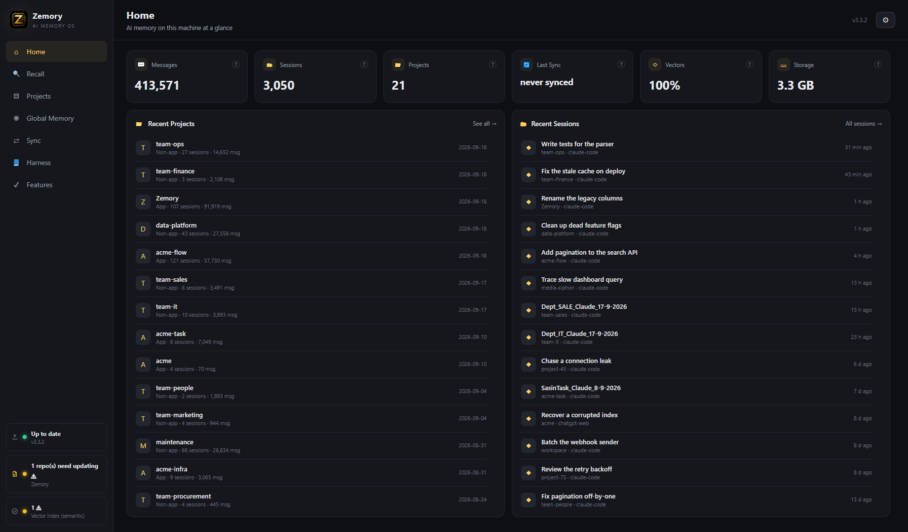
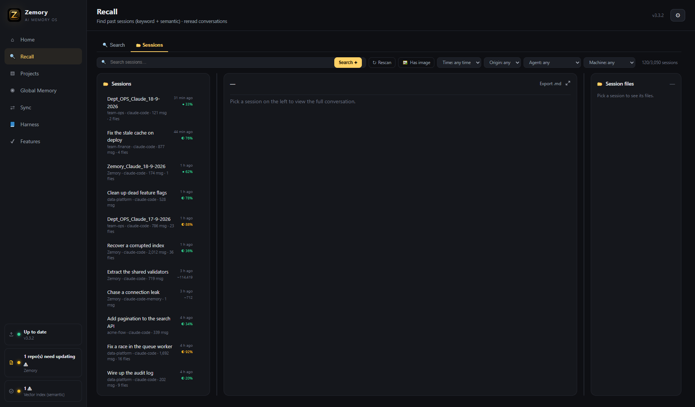
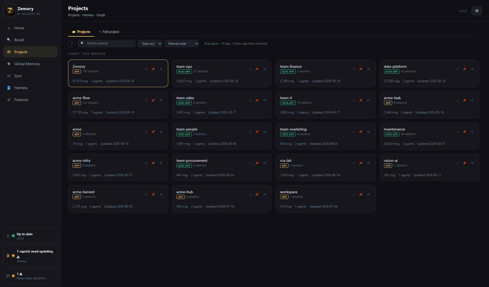
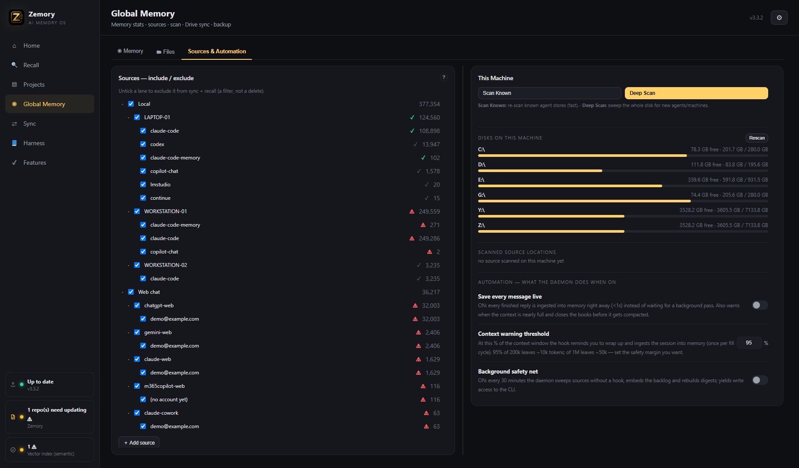
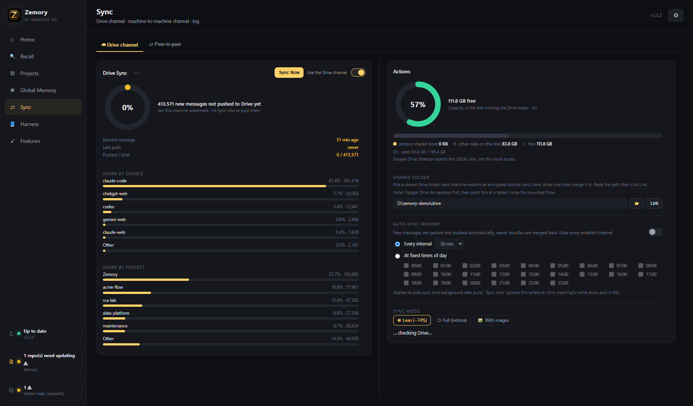
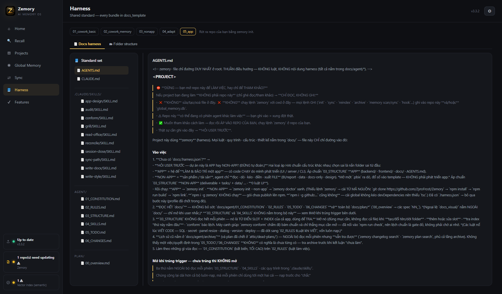
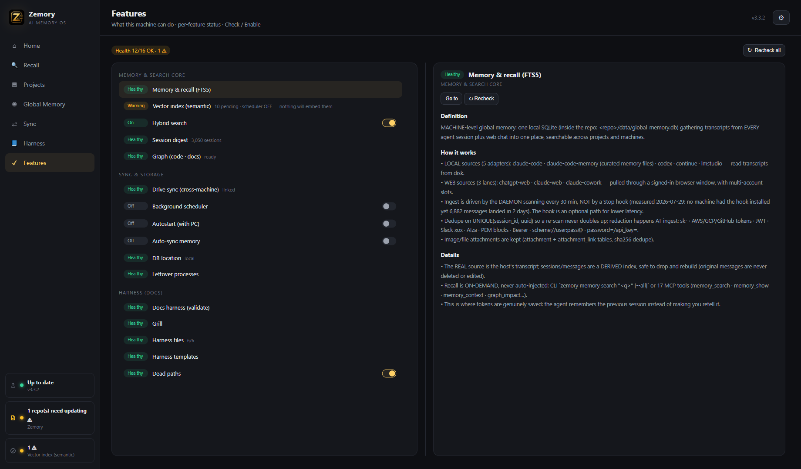
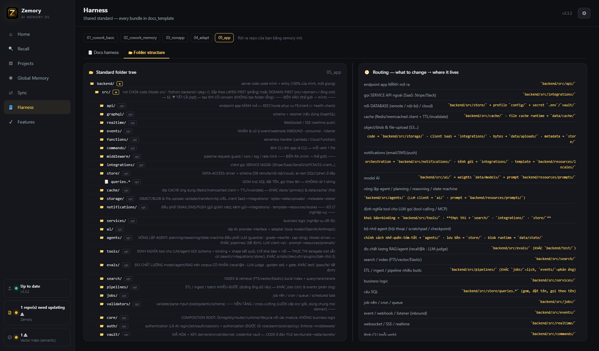

<div align="center">

# zemory

**A project harness for building apps of any kind — plus a local, cross-session memory for the agents that build them.**

Zemory gives every project a **standard docs + architecture harness** — a ~40-slot
structure standard that scaffolds *any* app (web, CLI, desktop, **and AI/LLM apps**,
with first-class `ai/` · `agents/` · `tools/` · `evals/` slots) — **and** a single
local memory that captures every coding-agent session so you can recall anything
across tools, projects, and machines, offline.

> **What agents most often misread:** zemory's *own* memory engine never calls an LLM —
> it only *scores/embeds* text with small local models. That is a fact about zemory's
> internals, **not** an anti-LLM philosophy and **not** a constraint on the apps you
> build with the harness. **Scaffolding LLM/AI apps is a first-class use of the
> harness.** Use the harness alone, the memory alone, or both.




**Seven screens, captured from a running instance** — [full tour below ↓](#the-cockpit--a-screen-by-screen-tour)

| | | |
|:--:|:--:|:--:|
| [](#1--home--the-at-a-glance-row)<br>**1 · Home** — six tiles, recent projects & sessions | [](#2--recall--find-the-session-then-read-it)<br>**2 · Recall** — filter, pick a session, read the thread | [](#3--projects--linked-vs-discovered)<br>**3 · Projects** — linked cards vs discovered-by-machine |
| [](#4--global-memory--numbers-sources-files)<br>**4 · Global Memory** — sources, automation, files | [](#5--sync--two-channels-one-writer)<br>**5 · Sync** — Drive channel and peer-to-peer | [](#6--harness--the-shared-standard-readable-in-the-app)<br>**6 · Harness** — the shared standard, five bundles |
| [](#7--features--what-this-machine-can-actually-do)<br>**7 · Features** — 16 capabilities, each re-checkable | | |

</div>

---

## Table of contents

- [Why zemory](#why-zemory)
- [Highlights](#highlights)
- [Quickstart](#quickstart)
- [The cockpit — a screen-by-screen tour](#the-cockpit--a-screen-by-screen-tour)
- [Core concepts](#core-concepts)
- [Where things live on disk](#where-things-live-on-disk)
- [Guardrails (layer-1 machine locks)](#guardrails-layer-1-machine-locks)
- [The graph](#the-graph)
- [Dead paths](#dead-paths)
- [CLI reference](#cli-reference)
- [Web-chat capture](#web-chat-capture)
- [Scoped sync & recall](#scoped-sync--recall)
- [Cross-machine sync](#cross-machine-sync)
- [Privacy & retention](#privacy--retention)
- [For agents — the harness & standard](#for-agents--the-harness--standard)
- [Repository structure](#repository-structure)
- [Development](#development)
- [Architecture & safety model (constitution)](#architecture--safety-model-constitution)
- [Roadmap](#roadmap)
- [Acknowledgements](#acknowledgements)
- [License](#license)

---

## Why zemory

Coding agents (Claude Code, Codex, Continue, LM Studio, Copilot Chat, and web chats like
ChatGPT or Gemini) each keep their own memory in their own place. Across a week you lose
track of *what you decided, why a fix worked, or where a session ran* — and every
project's rules/TODO/changelog quietly drift out of sync with the code.

Zemory is **two independent tools** you can use separately or together:

- **A per-project harness (the default — no database needed).** A standard set of
  docs (constitution, rules, **structure**, skills, TODO, changelog, numbered plans)
  plus a **~40-slot folder standard** that scaffolds *any* app and keeps the agent's
  work aligned with the code. The structure standard covers every concern of a modern
  app — API, store, jobs, auth, i18n, UI — **including the slots for building AI/LLM
  apps**: `ai/` (model provider), `agents/` (agent loop / planning), `tools/`
  (LLM tool-calling), `evals/` (quality gates). The same harness scaffolds a CRUD
  service or an LLM agent app.
- **A Global Memory (optional).** Every agent session on your machine ingested into a
  single local SQLite database you can search by keyword or meaning — across every
  project and machine.

**About "never calls a model API".** This is a rule for zemory's *own* memory
engine: it *scores/embeds* text with small local ONNX models; it never *generates*
text and never proxies a model API. It says **nothing** about the apps you build with
the harness — those can be as LLM-centric as you want. The "intelligence" is the agent
already driving your terminal; zemory gives it durable memory and a disciplined,
standard workspace.

---

## Highlights

| | |
|---|---|
| 🏗️ **App harness & standard** | A ~40-slot architecture standard + curated docs (constitution ↔ rules ↔ structure ↔ skills ↔ TODO ↔ changelog ↔ numbered plans) that scaffolds *any* app — from a CRUD service to an **LLM agent app** (`ai/` · `agents/` · `tools/` · `evals/` slots). Five ready bundles ship in `docs_template/`. `.md` is the source (file wins); the DB is a derived index. |
| 🧠 **Global Memory** | Eleven ingest lanes in one local SQLite database, deduped, secret-redacted, digested — six on-disk agents (Claude Code, Codex, Continue, LM Studio, VS Code Copilot Chat, curated memory files) and five web platforms. |
| 🔎 **Hybrid recall** | FTS5 keyword (word **+ trigram**, so substrings and non-Latin work) fused with a local vector index (EmbeddingGemma via Transformers.js — no Python, no GPU) through RRF, plus an "I don't know" gate that answers *nothing* rather than confident noise. Every stage **fails open** to FTS. |
| 🌐 **Web-chat capture** | Pull **ChatGPT**, **Gemini**, **claude.ai**, **Claude Cowork** and **Microsoft 365 Copilot** history through a login-once browser window — no password ever touches zemory. Several accounts per platform, each under its own e-mail; the daemon watches the login window and pulls as soon as you are in. Background pulls run off-screen. |
| 📎 **Attachment store** | Images and documents sent in a chat are kept, deduped by `sha256`, and written to `global-memory/files/` as real files on disk — browsable per session or across the whole memory, and carried to other machines with the rest. |
| 🧭 **Provenance lanes** | Every session is stamped with `origin` (local/web), `host` (machine), and `source` (agent) — one column, not a second store. Filter, roll up, and **exclude** lanes. |
| 🕸️ **Code & docs graph** | On-demand import graph (TS/JS/Python + six more grammars loaded on demand), tree-sitter symbols, an FE↔BE `api` seam, `graph impact` (blast radius), `graph fitness`, `graph export --json`. A **derived** layer — declared and inferred edges never mix. |
| 🧹 **Dead-path detection** | `zemory paths check` finds path strings in docs and config that no longer point anywhere, judged only under roots you declared. It reports **newly dead** rather than everything, proposes a fix when exactly one target matches, and never writes without your click. |
| 🖥️ **Background daemon** | A single instance on fixed port **4444** that opens in a native app window with its own taskbar icon, a system-tray icon, optional start-with-OS, an idle scheduler (scan → embed → digest → dead-path sweep → backup), and a write-gate that serializes DB writes. One app, one window: a stale window closes itself when the daemon behind it is replaced. |
| 🔐 **Two sync channels** | A shared **Drive folder** carrying an encrypted, append-only segment chain, **or** a direct **machine-to-machine** channel (TLS 1.3, identity by certificate fingerprint, LAN discovery, block-level transfer). Read from both, write to exactly one — two writers is what corrupts a store. |
| 🔌 **MCP server** | 17 tools for any MCP client: recall (`memory_search` · `memory_show` · `memory_context`), specs (`plan_search` · `plan_show`), graph (`graph_impact` · `graph_neighbors`), and control (`memory_jobs` · `memory_scan` · `memory_embed` · `project_merge` · `session_pin`). Control tools only delegate to what the CLI already does; a busy write-gate answers "busy" with the holder's name instead of racing it. |
| 🕵️ **Privacy tools** | Forget, re-redact, back up, restore, and salvage a corrupted store — all local, dry-run by default, backed up before deleting. |
| 🛡️ **Layer-1 guardrails** | `zemory hook guard` generates real machine locks (PreToolUse + pre-commit) from your `protected` / `secretNames` markers: recursive and mass deletes, discarding uncommitted work, secrets reaching a commit. One-shot `.allow-*` flags. **A safety net for when the agent forgets a rule — not permission to skip asking you.** |
| 📐 **Gates, not promises** | `conform` (standard drift) · `validate` (docs) · `todo verify` (re-measures every backlog item against the code) · `paths check --gate` · `graph fitness --gate` · a 10-dimension audit playbook. The repo's own doctrine: *what stops drift is code, not a rule someone must remember.* |

---

## Quickstart

**Requirements:** Node **≥ 20** and a C/C++ toolchain for the native `better-sqlite3`
build (Xcode CLT on macOS · `build-essential` on Linux · MSVC Build Tools on
Windows). The embedding and rerank models download on first `memory embed`
(cached under `<repo>/data/models`, never committed — about 4.4 GB once both are
fetched). On Windows the cockpit uses the system **WebView2** runtime for its native
window and falls back to an Edge app window if it is absent. No GPU, no Python, and no
network at runtime beyond that one-time model fetch.

Zemory is installed **once per machine** and shared by every project. It is not on
a public npm registry yet — install from this repo:

```bash
git clone https://github.com/ZyroFrost/Zemory.git
cd Zemory
node backend/scripts/fetch-prebuilds.mjs   # see note below — run BEFORE npm ci
npm ci
npm run build
npm install -g .           # exposes the global `zemory` command (or: npm link)

zemory setup               # describes what gets installed, and OFFERS the shortcuts
zemory memory scan         # ingest existing agent transcripts on this machine
zemory hook install        # auto-capture new Claude/Codex sessions (0 tokens)
zemory memory embed --all  # build the semantic vector index (enables hybrid recall)
zemory doctor              # verify everything is green
```

Because `npm install -g .` links the repo, a later `npm run build` updates the
global `zemory` command in place — no reinstall needed. From **3.3.2** the cockpit's
*Update now* button does the whole pull-rebuild-restart cycle for you on Windows too.

**Shortcuts (asked, never assumed).** zemory runs as a background daemon, so it needs a way to
open its window. `zemory setup` prints exactly what it would create and where, then asks — and
creates nothing until you answer:

| target | path (Windows) |
|---|---|
| Start Menu entry | `%APPDATA%\Microsoft\Windows\Start Menu\Programs\Zemory.lnk` |
| Desktop icon | your Desktop folder (the **redirected** one if the machine puts Desktop in OneDrive) |

Both launch a hidden `.vbs` so no console window appears; neither touches the registry and no
service is installed. On Linux a `.desktop` entry is written, on macOS a `.command` file.

The prompt only appears when a real terminal is attached — install scripts, CI and agent sessions
are never blocked waiting for an answer. For those, decide up front with `zemory setup --shortcut`
or `--no-shortcut`. Either way the switch stays in **Settings → Shortcuts**, and turning it off
removes what it created.

**Why `fetch-prebuilds` comes first.** `better-sqlite3` downloads its prebuilt binary from
`github.com/<repo>/releases/download/…`. Networks that block or throttle that host (measured on
one corporate network: 1 of 10 attempts succeeded, while `api.github.com` succeeded 10 of 10)
push it into `node-gyp rebuild`, which needs a C++ toolchain — so a clean clone fails to install
at all. The script fetches the same asset through the release **API** and drops it into the
`prebuild-install` disk cache, so `npm ci` finds it locally. It must run *before* `npm ci`: npm
executes a dependency's install script before the root package's `preinstall`, so no lifecycle
hook fires early enough. It is safe to skip on unrestricted networks, and safe to re-run.

**Add a docs harness to a project (optional):**

```bash
cd your-project
zemory init && zemory doctor
```

Any project can query the shared memory even with no harness; `zemory init` only
adds the curated constitution/rules/structure/TODO/changelog/plan docs.

---

## The cockpit — a screen-by-screen tour

```bash
zemory ui
```

Starts (or attaches to) the background daemon on `http://127.0.0.1:4444` and opens a
**native app window** with its own taskbar icon. It is **single-instance**: a second
`zemory ui` focuses the running window instead of spawning a duplicate, and a window
whose daemon has been replaced closes itself rather than sitting there looking alive.
A system-tray icon offers Open and Quit. Override the port with `ZEMORY_UI_PORT`.

Navigation is a **left rail with seven screens**. The guiding rule: *a screen that does
several things gets sub-tabs — it never spawns another rail entry*, and **one number
lives in exactly one place**; anywhere else links to it. Two themes (dark default,
light monochrome) and full VI/EN i18n; every user-visible string goes through both
dictionaries, with technical terms (Recall, Hybrid, FTS5, vector, embed, token)
deliberately left untranslated.

> The screenshots below are **captured by a script** against a **scrubbed copy** of a real
> store: `node backend/scripts/shoot-ui.mjs` drives a headless browser over CDP, clicks each
> rail entry and sub-tab, verifies the tab actually became active, and only then writes the
> file. Counts, sizes and coverage are the real ones; project names, session titles, machine
> names and account e-mails are replaced. Documentation images that need a human to remember
> to retake them go stale, and a stale screenshot describes a product that no longer exists.

### 1 · Home — the at-a-glance row


Six tiles answer "is the memory healthy?" in one look: **Messages · Sessions · Projects · Last
Sync · Vectors · Storage**. Below them, recent projects and recent sessions. The chips at the
bottom of the rail are the standing alarms: zemory's own version, how many linked repos have
fallen behind the standard, and the rolled-up health of the 16 feature checks.

### 2 · Recall — find the session, then read it


Two sub-tabs: **Search** (across messages) and **Sessions** (browse whole threads). Filters cover
*has-images · time · origin · agent · machine*, with the live count (`120/3,050 sessions`) so a
filter never silently hides everything. Pick a session on the left and the whole conversation
opens in the middle, exportable to `.md`; a third column lists **that session's files**.

Display rule worth knowing: prose renders **in full, exactly as chatted**, while code blocks and
`tool_use`/`tool_result` are **collapsed** behind a click. That split came from a measurement, not
taste — **52.5%** of 167,738 messages contained tool traffic, and that is what makes a transcript
unreadable, not message length.

### 3 · Projects — linked vs discovered


Two tabs. **Projects** holds the linked cards (App / Non-app badge, sessions, messages, agents,
last update) with a search box, type filter, sort, **pin** and **remove** — removing only drops a
card from the picker; the folder, its docs and its memory are untouched. A card whose harness is
behind the current standard carries an **⚠ outdated** badge, the same measurement the rail chip
uses. Each card keeps its three action buttons pinned to the top-right corner at every width.

**Add project** holds everything zemory has *seen but not linked*, **tabbed by machine**, each row
offering **Add** (zemory manages it) or **Merge** (fold its sessions into another project), plus one
**Rescan** button and **Prune missing**. Prune shows what it will do before it does it: drop linked
projects whose folder is gone, **merge** old roots into the linked project with the same folder name
(a repo you moved or renamed), and fold the rest into a collapsed *folders gone* group. Sessions are
never deleted — a root is only re-pointed and pinned so the next scan does not split it again.

### 4 · Global Memory — numbers, sources, files


Three sub-tabs. **Memory** holds the statistics. **Sources & Automation** holds the provenance
tree and the switches that decide what the daemon does on its own. **Files** is the attachment
store.

- **Sources** — the provenance tree (Local → machine → agent, Web → platform → **account**) with
  live counts, collapsible groups and a legend. A tick means *this lane may enter the memory
  and be embedded*; untick it and zemory stops pulling it, leaves its existing rows out of the embed
  queue, and drops it from sync and recall. It is a *filter, never a delete*. Web accounts are keyed
  by the **e-mail the site reports at login**, never by browser slot — sign a second account in and
  it becomes its own row with its own history. Status marks follow two rules: web is binary (✓ linked
  · ⚠ signed out — click to reconnect); local on this machine is ✓ store on disk · ⚠ store gone;
  local from another machine is ✓ still syncing in, greyed once that machine has been quiet for 30
  days. Parent rows roll their children up.
- **This Machine** — *Scan Known* vs *Deep Scan*, the disks it can see, and the automation
  switches with their real behaviour spelled out: save-every-message-live, the context-warning
  threshold, and the background safety net.

**Files** is every image and document that ever went through a chat, pulled out of the database
and written to `global-memory/files/` as real files, sorted into `images/`, `documents/` and
`other/` by month. One content equals one file on disk: the name carries the first eight
characters of its `sha256`, so the same picture sent five times costs one copy. Filter by kind,
search by name, click through to the exact message it came from. Files you add by hand (drag-drop
or *Add file…*) have no originating message, so that jump button is hidden rather than dead.

### 5 · Sync — two channels, one writer


Sync is its own screen with two channel tabs and a log. The left panel is the same on both:
what the newest message is, when the last push happened, how much is pushed of the total, and
the split of the store by source and by project.

The **Drive channel** writes an encrypted, append-only chain of segments into a shared cloud
folder. Appending is a real append — a routine sync adds a few hundred kilobytes rather than
rewriting the store — and a segment that fills up is sealed for good, so the cloud client never
re-uploads it again. Depth is a choice: **Lean (−74%)** carries source rows, **Full** carries the
derived layer for disaster restore, and **With images** adds attachment bytes.

The second tab, **peer-to-peer**, skips the cloud entirely. Two machines authenticate each other by
**certificate fingerprint** over TLS 1.3, find each other on the LAN by UDP discovery, compare the
set of blocks each already holds, and ship only what is missing. Identity, pairing code and the
sync direction for each pair live here, next to a read-only tail of the daemon log — which exists
because the daemon window is deliberately hidden, and hiding the console without offering the log
would remove the only way to answer *why won't it connect*.

> **Read both, write one.** Enabling a channel controls what zemory will *accept*; the write
> target is a single choice. Two writers into one store is what corrupted this project's database
> twice, and is why article 11 exists.

### 6 · Harness — the shared standard, readable in the app


Five bundles ship in `docs_template/`, and this screen renders all of them: the **app** and
**non-app** standards, two Cowork kits, and an **adapt** profile for a repo whose structure must
not be reshaped. Sub-tab **Docs harness** renders the template documents; the second sub-tab is
the structure standard itself:

> **Language, stated plainly:** the app is bilingual VI/EN, but the shipped standard documents are
> written in Vietnamese — that is what the two screenshots here show. Translating them is open work,
> not a decision against English; the folder names, slot names and routing targets are ASCII English
> throughout, so the structure is usable before the prose is.



The full slot tree beside the **routing table** — *"changing X → goes where"*. This is the part
that saves tokens in daily work: an agent reads the routing line and opens the right folder
instead of grepping the repo. Note the first-class AI slots — `ai/` · `agents/` · `tools/` ·
`evals/` — the same standard scaffolds a CRUD service or an LLM agent app.

### 7 · Features — what this machine can actually do


Sixteen capabilities with live status, grouped into *memory & search core*, *sync & storage* and
*harness (docs)*. Every badge uses one vocabulary — **On / Off** for switches, **Healthy /
Warning / Off** for everything else — and figures such as `2 pending · auto-embedding` sit in grey
after the name, not inside the badge. The vector index counts as healthy while the background
scheduler is on, however long the queue is: a store that receives messages all day never reaches
zero, so the question worth asking is *is something draining it*, not *is it empty*. Click a row
and the right pane explains **what it is · how it works · the details that bite**. Each row has a
**Check** button that re-measures instead of repeating what a config file claims, and rows with
something to switch carry the switch on the row itself.

The update chip at the bottom of the rail is the same idea for the tool. It is always visible:
green when nothing needs doing, orange when another machine has published a newer zemory or a
linked repo has fallen behind the standard. Clicking it opens an **Update** box: the top half
pulls, rebuilds and restarts the daemon; the bottom half lists the repos behind the standard with
a checkbox each and applies the same gap-fill `zemory sync` and `zemory hook guard` would run
inside that repo. Writing into another project is otherwise forbidden — here your click is the
permission, for those repos, this once. Both halves also have a plain **re-check** button, so you
never have to wait out the ten-minute poll to see a repo you just fixed.

Any region with two or more adjacent panels has a **drag-to-resize** seam; sizes persist across
sessions. The markdown docs remain the **source** — edit the `.md` directly (file wins); the DB is
a derived search index rebuilt from those files.

---

## Core concepts

### Global Memory

One SQLite database at **`<repo>/global-memory/global_memory.db`** (schema v25), with the
attachment files beside it in `global-memory/files/`. `zemory memory scan` ingests agent
transcripts incrementally and idempotently; the daemon's scheduler keeps it current with zero
extra tokens, and `zemory hook install` is the optional path when you want lower latency than
the 30-minute sweep. Messages are deduped, secret-redacted, and summarized into per-session
digests for cheap recall. **Never** put the live database in a cloud-synced folder — a WAL
database synced by a cloud client corrupts, which is how this project learned the rule.

### Provenance & origin

Every session carries `origin` (`local` = agent transcripts on disk, `web` =
captured web chat), `host` (the producing machine), and `source` (the tool). This
is what powers filtering, per-machine rollups, and scoped sync — with **one
column, not a second store**. Scope selectors only *filter*; they never rewrite or
merge a session's provenance.

### Recall (hybrid)

Recall fuses two FTS5 streams (word + trigram) with a local vector stream through Reciprocal
Rank Fusion, blended with a recency signal. Every added stage **fails open** — if the model is
unavailable, recall degrades to keyword FTS instead of breaking. FTS5 is always the baseline; the
semantic layer only *adds*.

Vectors are **768-dimensional, fp32** (EmbeddingGemma via Transformers.js). An earlier build
truncated them to 256d to halve the file; re-measuring later showed the cut had cost `recall@1`
**91% → 74%**, with 44% of questions unreachable at any depth — bought back with 43 hours of
re-embedding. Hence the standing rule in this repo: **capacity is never bought with quality, and
trimming a layer must clear the same gate as adding one.**

Cross-encoder **rerank ships off by default**, because it was measured here rather than assumed:
on this corpus it *lowered* recall (`@10` 35% → 28%) while costing **11.6×** the latency. A far
cheaper reranker — mixing in cosine over vectors already stored — won at about 119 ms and is on.
Two scoreboards are reported side by side: *strict* (the exact labelled message) and *equivalent*
(any near-duplicate that answers the question). They can disagree, and using the wrong one leads
to wrong decisions.

An **"I don't know" gate** is on by default: when the nearest vector is far enough away, recall
says so instead of returning forty confident-looking rows. On a 108-label corpus it blocked 17 of
20 held-out nonsense questions while costing nothing that was already being answered.

Multi-query (`--also`) is a **high-variance** lever, not a free win: a rephrasing that keeps the
original's specificity lifted `@10` by about 21 points, while a vaguer one dropped MRR **below**
asking nothing at all. Send one good rephrasing, or none.

### The harness (standard + per-project)

`docs_template/` is the **shared, generic standard** shipped with zemory — the canonical rules and
the *method* for storing them, in five bundles (app, non-app, two Cowork kits, and adapt). Its
`03_STRUCTURE` is a ~40-slot dictionary covering every concern of a modern app — including the
AI/LLM slots (`ai/` · `agents/` · `tools/` · `evals/`) — so the *same* harness scaffolds a plain
service or an LLM-centric app. Installing the harness into a project is not a blind copy: zemory
scaffolds the **structure**, and the working agent reads the standard and **adapts it to the
project**. Project-specific content (TODO, changelog) is never copied from another project.

---

## Where things live on disk

Two folders, and the split is the whole point: one travels with you, one never leaves the machine.

```text
<repo>/global-memory/        ← the memory. This is what reaches your other machines.
  global_memory.db           SQLite store (+ -wal / -shm)
  files/                     attachment bytes: images/ · documents/ · other/, by month
  channel/                   encrypted segments for the peer-to-peer channel

<repo>/data/                 ← this machine only. Article 14: never git, never a cloud folder.
  share.key · secrets/       the identity that decrypts your bundles
  browser/                   signed-in browser profiles for web capture
  models/                    embedding + rerank weights, fetched at runtime
  backups/                   rotating local backups of the store
  config.json · logs/        settings and the daemon log

~/.zemory/location.json      ← the only thing left in $HOME: a pointer holding both paths.
```

Move the whole cluster with `zemory memory relocate`. The pointer holds no secret, which is why
it is allowed to stay in `$HOME` — keeping it beside the store would be circular.

---

## Guardrails (layer-1 machine locks)

Some rules cannot be repaired after the fact: a secret reaching a commit, a write into a protected
path, `git push` before you asked, a recursive delete. Prose alone catches those **after** they
happen — so zemory generates actual locks:

```bash
zemory hook guard        # writes policy.json + guard.cjs + precommit-guard.cjs into <harness>/hooks/
                         # prints how to wire them — YOU approve and wire; the tool never self-installs
```

`policy.json` is generated from the `protected` / `secretNames` markers in `.harness.json`, so the
rules follow your repo instead of a hardcoded list (`protected_write` takes globs, for example
`data/*/01_raw`, because case names are not known in advance). Measured coverage: **22 of 28**
deletion shapes blocked, including the ones that look nothing like `rm -rf` — `find -delete`,
`find -exec rm`, `fs.rmSync(recursive)` inside `node -e`, `shutil.rmtree`, `git clean -fdx`,
`robocopy /MIR`, `xargs rm`, a piped `Get-ChildItem | Remove-Item` — plus `git reset --hard` and
`git checkout -- .`, which destroy work that was never in git to begin with.

The remaining 6 pass **on purpose**: deleting a single ordinary file, `>` redirection, `mv`. A gate
that fires on everyday work is a gate people route around, and then it protects nothing.

> **Read the role correctly.** These hooks are a **safety net for when the agent misses or forgets a
> rule** — they are neither a ban on deleting nor a licence to delete. **Deletion always goes
> through the user.** *The hook staying quiet ≠ you may proceed* (it only knows the shapes it was
> taught); *the hook firing ≠ you're done* (go ask, don't route around it, don't mint your own
> flag). Prose is the deciding layer; the machine is the catching layer — drop either one and the
> other cannot carry it alone.

---

## The graph

Zemory builds a **derived** graph over your repo — rebuildable from `.md` + code +
memory at any time, with **0 LLM** calls. Two edge classes never mix: **declared**
(deterministic — imports, doc references, supersede markers, routing entries, session
digest touches) and **inferred** (fail-open overlay — cosine `semantic_neighbor`, name-matched
`calls`, and an `api` seam matching the routes the frontend calls against the routes the backend
serves, each with an honest confidence label that is never self-promoted).

Besides files, the graph carries the **standard itself** as nodes: constitution articles, skills,
numbered plans, harness docs, slots and the routing concerns that point at them. That is what lets
it answer *"which file is carrying a dead path"* and *"which concern owns this folder"* rather than
only *"who imports whom"*.

```bash
zemory graph impact <file>     # blast radius: who imports this (direct + transitive), hub flag, touched-by
zemory graph callers <symbol>  # call sites of a function / Class.method, with confidence
zemory graph path <a> <b>      # shortest link between two files across all three edge layers
zemory graph fitness [--gate]  # hub% · isolated% · util-purity (exit 1 on fail → CI-able)
zemory graph export --json     # contract v2: nodes(+symbols+touchedBy) · edges · orphans · fitness
```

In the cockpit, the **Graph** sub-tab of a project lights up the graph and the folder tree
together, sizes nodes by fan-in, colours them by structural slot, and marks the files that carry
dead paths.

---

## Dead paths

Folders get renamed and moved; the paths written about them in docs and config quietly stop
pointing anywhere, and nothing notices until a session walks into one. `zemory paths check` is the
deterministic sweep for that, and the design is mostly about **not crying wolf**:

- It judges only what sits under a root you declared, and **says so** when it cannot judge
  something rather than guessing.
- It reports **newly dead** paths, not every dead-looking string — a sentence describing a design
  that was rejected two months ago is not a broken link. The first run records a baseline.
- A newly dead path needs **evidence it was once alive**: either a previous sweep saw it resolve,
  or git records the file being deleted or renamed. Without evidence it is listed but never
  coloured.
- `paths fix` proposes a replacement only when exactly one file in the repo carries that name, and
  writes only on `--apply` or your click.

```bash
zemory paths check [--gate] [--root <dir>]   # three buckets: dead · historical · cannot judge
zemory paths sweep                           # every linked project, records state, never fails the build
zemory paths fix [--apply]                   # propose (and on request apply) unique-name repairs
```

The daemon runs the sweep as part of its maintenance chain, the Features screen carries the
switch, and the graph tints the files that are carrying dead paths.

---

## CLI reference

```text
# Memory
zemory memory scan [--deep]              Ingest agent transcripts (deep = walk the disk)
zemory memory scan-web --platform X      Capture web chat (chatgpt | gemini | claude | m365copilot)
zemory memory scan-web ... --account 2   Pull a second account of the same platform (its own slot)
zemory memory borrow-cookies --platform  Reuse the session already signed in in your own browser
zemory memory promote                    Find repeated corrections in episodic memory; proposes, never writes
zemory memory search "q" [--all]         Recall (this project | everywhere)
zemory memory search "q" --also "..."    Add a rephrasing — fused by RRF (see the warning above)
zemory memory embed [--all] [--rebuild]  Build/refresh the semantic vector index
zemory memory bench --recall             Score recall against the labeled corpus (strict + equivalent)
zemory memory scope [exclude|include]    Provenance tree; exclude a lane from sync+recall
zemory memory hosts                      Sessions by machine -> agent -> project
zemory memory digest <session>           Show a session's summary digest
zemory memory files ls|extract|add|collect|verify|gc
                                         The attachment store: list, pull bytes out of the DB,
                                         add your own, harvest agent-written files, check, clean
zemory memory channel id|status|pair|sync|probe
                                         The machine-to-machine channel: identity, pairing, transfer
zemory memory sync --dir <folder>        Cross-machine sync through a Drive folder (append-only)
zemory memory vectors-catchup            Ship vectors the channel is missing, without rewriting it
zemory memory export <f.enc> [--full]    Encrypted bundle out (--full also carries the vector index)
zemory memory import <f.enc> [--merge]   In: default REPLACES the store; --merge only ADDS source rows
zemory memory keygen | key show|set|path Share key = your identity; `key show` prints only a fingerprint
zemory memory forget [--session id]      Privacy: forget rows (dry-run by default, backup on --force)
zemory memory redact                     Re-apply redaction to rows already stored
zemory memory backup / restore           Raw local SQLite backup / restore
zemory memory verify | audit             Is the store intact · counts that look wrong
zemory memory salvage <db> <out>         Rescue readable rows out of a corrupted store
zemory memory relocate <dir>             Move the store and its cluster somewhere else
zemory memory where | info | stats | vacuum

# Graph (derived, 0 LLM)
zemory graph impact <file>              Blast radius for a change
zemory graph callers <symbol>           Call sites of a symbol (confidence-labeled)
zemory graph path <a> <b>               Shortest link between two files
zemory graph fitness [--gate]           Structural fitness metrics (+ CI gate)
zemory graph docs                       The docs layer on its own
zemory graph export [--json] [--out f]  Versioned graph contract for external tools

# Harness & docs (.md is the source; DB = derived index)
zemory init | sync                      Scaffold / gap-fill the project harness
zemory structure                        Print the repo structure standard (+ routing)
zemory validate                         Lint the docs harness (links, length, supersede)
zemory conform [--gate]                 Score how closely the folder follows the standard
zemory paths check|sweep|fix            Dead paths in docs and config
zemory todo verify                      Re-measure every 05_TODO item against the code; print drift
zemory doctor                           Verify docs, providers, capabilities
zemory plan ls | search | show          Search project specs
zemory changelog ls | search            Search the changelog
zemory reindex                          Rebuild the docs search index from .md (read-only)
zemory archive                          Trim an over-long changelog into the archive

# Interfaces
zemory ui                               Background daemon + cockpit (port 4444, single-instance)
zemory mcp                              MCP stdio server (17 tools: recall · specs · graph · control)
zemory setup                            Print the setup runbook; offer the shortcuts
zemory sweep [--dry-run]                Close leftover browser processes zemory started
zemory selfupdate [--check]             Pull + rebuild this install; stops if the tree is dirty
zemory hook install                     Install the 0-token capture hooks
zemory hook guard                       Generate the layer-1 machine locks (you wire them yourself)
```

> **`import` vs `import --merge` is the one command pair worth reading twice.** Merge only ever
> reads four tables (`schema_version` · `sessions` · `messages` · `known_stores`) — so a `--full`
> bundle that is *merged* still drops the vector index, which is most of the file. Plain `import`
> replaces the store wholesale (the old one is renamed aside as `.bak-*`), and that is the only
> path that carries the semantic layer to another machine.

---

## Web-chat capture

Web chats live on the server — there is no file on disk for `memory scan` to read. Zemory captures
them with a **browser-connector**. **ChatGPT**, **Gemini**, **claude.ai**, **Claude Cowork** and
**Microsoft 365 Copilot** all pull today; six further platforms are wired for sign-in and will pull
once someone with an account measures their listing shape.

```bash
zemory memory scan-web --platform chatgpt # opens a login-once window; log in ONCE
zemory memory scan-web --platform gemini
zemory memory scan-web --platform claude  # claude.ai (+ Cowork sessions)
zemory memory scan-web --limit 5          # pull just the newest 5 (quick verify)
```

Zemory opens a dedicated browser profile (`<repo>/data/browser/<platform>`, in your machine's
default browser — Chrome, Edge or Brave), you log in on the real site (id/password/2FA go to
OpenAI, Google or Anthropic, **never** to zemory), and zemory drives that logged-in tab over CDP to
read the site's own conversation API — running inside the real browser so it passes Cloudflare.
Pulls are **batched and resume-safe** and paced to ease rate limits. Captured chats land in the same
memory under `origin=web` and are fully searchable, attachments included.

**Signing in is a two-step loop, and the daemon closes it.** From the cockpit, click the ⚠ mark on
a web row: a window opens on the login page, the daemon polls it every 5 seconds for up to 15
minutes, and the moment you are in it records the account, pulls the conversations, and navigates
that same tab to a **"✓ linked as you@example.com — pulled N of M"** page so you know it worked.
The poll only reads; it never closes tabs (an earlier version did, and killed the browser
mid-OAuth). Automatic pulls run in an **off-screen** window that closes when done; the only time a
visible window appears is when you asked to link an account.

**Accounts are identities, not browser slots.** Each session is stamped with the e-mail the site
reports, so a second account of the same platform gets its own row and its own history, and a slot
later signed in with a different account cannot "take over" the old one. Claude accounts belonging
to several organisations are enumerated across every org that has chat enabled. When an old
conversation reappears in a fresh listing it is re-attached to the account that listed it, which is
how history moves to the right row after a re-login; conversations already deleted on the site stay
in an *unassigned* row until you decide.

> ⚠️ Captured conversations and attachments contain real personal data and are **never
> committed** — only code and the blank templates live in this repo.

---

## Scoped sync & recall

Some lanes are shared or noisy and you don't want them in your personal memory's
sync or recall. Untick them in the cockpit's **Sources** tree, or use the CLI:

```bash
zemory memory scope                        # show the Local/Web x machine x agent tree
zemory memory scope exclude --source codex # leave codex out of ingest, sync and recall
zemory memory scope exclude --origin web   # leave all web chat out
zemory memory scope include --source codex # undo
```

Exclusion is a **filter, not a delete** — the data stays in the local store; it is
simply left out of ingest, exported bundles, incoming merges, and recall results.

---

## Cross-machine sync

Each machine keeps its own local store, and that local copy is always the complete one. A channel
is only where machines meet: losing it loses nothing.

**Drive channel.** Point every machine at the same cloud folder and give them the same share key.

```bash
zemory memory sync --dir "G:\My Drive\Global Memory"
```

The channel holds **one logical store** written as a chain of sealed segments. A sync appends the
blocks this machine has that the channel does not, then merges everything it has not seen. Append
is genuinely an append: nothing is overwritten, every session keeps the `host` that produced it,
and re-merging the same block adds zero. Segments are capped at 256 MB and sealed when full,
because a cloud client re-uploads a whole changed file — appending 0.3 MB to a 2 GB file once cost
this project two frozen sync clients in an hour.

**Peer-to-peer channel.** No cloud at all. Each machine has a device ID derived from its own
self-signed certificate; pair them once, and from then on they authenticate by fingerprint over
TLS 1.3, discover each other on the LAN, exchange the set of block signatures they hold, and ship
only the difference. Machines on different networks need one side reachable — a forwarded port or
an existing VPN — since neither of the automatic port-opening protocols answered on the networks
measured here.

### Bringing a second machine up so it works immediately

Four things must arrive, and they travel by **four different channels** — miss one and the machine
comes up half-working:

| what | channel | note |
|---|---|---|
| source, templates, hooks | **git** | never any data or secret |
| store **+ semantic index** | **a `--full` bundle**, restored with `memory import` | `sync`/`--merge` carries source rows only |
| the share key | **carried by hand** (`memory key set`, reads stdin) | compare `key show` fingerprints on both ends |
| models (~4.4 GB) | **downloaded at runtime** | needed at **query** time too — without them recall silently falls back to keyword |

Verify a bundle the way the receiving machine will consume it — decrypt it to a scratch path and
count rows, coverage and `vec_config`. "The file exists" is not evidence, and a file sitting in a
cloud folder has not necessarily **left the machine** — check the sync client's own queue, not the
folder listing.

---

## Privacy & retention

```text
zemory memory backup [out.db]             Raw local SQLite backup
zemory memory restore <backup.db> --force Restore a raw backup (renames the old store aside)
zemory memory forget --project .          Dry-run forget for the current project
zemory memory forget --session <id> --force
zemory memory redact --force              Re-apply secret redaction to old rows
zemory memory files gc                    Drop stored files nothing points at (dry-run first)
```

`forget` is a dry-run unless `--force`, and always backs up before deleting. It removes rows from
zemory's derived memory and vector index; it does not delete the agent's original transcript files.
Attachment bytes pulled from a web platform are treated as a **second-source original** — the
platform may have deleted the conversation, which makes the local copy the only one left — so no
cleanup pass removes them silently. Anyone who can read the share key can decrypt the bundles.

---

## For agents — the harness & standard

If you are an agent working **in a project that uses zemory**, read the harness in
order: `AGENTS.md` (the thin router at the repo root) → `docs/agent/01_CONSTITUTION.md`
(architectural invariants, supreme) → `02_RULES.md` (work rules) → `03_STRUCTURE.md`
(folder standard + routing) → `04_SKILLS.md` (playbooks) → `05_TODO.md` → `06_CHANGES.md`.
Everything you need is in `docs/` — `AGENTS.md` only points the way.

If you are an agent working **in *this* repo (zemory itself)**: it is the canonical
source other repos copy from. Read `docs_template/` (the blank standard) and apply
it **in your own repo** — do not write here or run `zemory` with this as the cwd
unless the user explicitly allows it (another session may be working here).

Recall from other sessions on demand — do not guess:

```bash
zemory memory search "<what a past session decided>" --all
```

---

## Repository structure

Zemory follows the same standard it ships. Four roles are required — `backend/` (code),
`frontend/` (UI), `docs/` (harness), `AGENTS.md` (entry) — and code is arranged **domain-first**:

```text
backend/                server-side: 100% first-party code + thin entry surfaces
  src/
    memory/             the memory domain: store · ingest/search/digest · embed/rerank
      adapters/         one per agent or web platform
      channel/          the peer-to-peer transport
      graph/            the derived code + docs graph
    docs/               the harness domain: plan · changelog · validate · conform · paths
    core/               composition root: registry · router · runtime (wiring, no business logic)
    modules/            capability providers (memory · search · harness · health)
    config/ · i18n/     cross-cutting (settings, localization)
    commands/           one file per CLI verb (thin — wire into a domain)
    platform/           OS integration: tray icon · native window · start-with-OS · process sweep
    jobs/               background: scheduler · write-gate · sync runner
    tools/              the MCP tool surface
  resources/            bundled tracked assets (packaging icons, seeds)
  scripts/              build and capture helpers
  test/                 tests for logic that can silently break
frontend/               the UI (served static by the daemon, no bundler):
  pages/ · styles/ · components/ · scripts/ · assets/
docs_template/          the BLANK standard other repos copy — five bundles
docs_public/            images published with this README
external/skills/        vendored third-party skills (kept verbatim)
AGENTS.md               thin router into docs/
```

> This repo's own `docs/` is **not** published: it is the private record of one installation —
> its plans, backlog and changelog — and nothing in it helps a stranger use zemory. What a
> stranger needs is `docs_template/`, which is blank and tracked. Runtime data, secrets and build
> output (`data/`, `global-memory/`, `.env`, `dist/`) are gitignored. Non-app deliverable projects
> (BI/report, data, docs-only) follow the non-app standard instead — `docs/` + `AGENTS.md` + a
> deliverable folder, no `backend/`/`frontend/`.

---

## Development

```bash
npm ci
npm run check         # strict typecheck + lint + tests (temp SQLite DBs)
npm pack --dry-run
```

- `backend/src/` is 100% first-party code; external libs and models are called through adapters or
  vendored under `external/`, never pasted into `backend/`.
- Docs: the `.md` file is the source (file wins); the DB is a derived search index, droppable and
  rebuildable with `zemory reindex`.
- UI strings go through i18n with both a VI and an EN entry (no hardcoded user-facing strings);
  technical terms (Recall, Hybrid, FTS5, vector, embed) are kept, not translated. Identifiers and
  file names are ASCII English.
- Tests run against throwaway databases; no network anywhere. The full gate runs each heavy file in
  its own process inside a 4 GB job object, because the suite once ate 16 GB and took the session
  down with it.

---

## Architecture & safety model (constitution)

The binding invariants live in this project's own constitution; a violation is a design bug even
when the code runs. In brief:

1. **Save tokens above all** — prefer calling or extending the best existing tool over rewriting
   it; a rule serves the goal, not the reverse.
2. **First-party vs third-party** — `backend/src/` is 100% yours; external engines are
   dependencies or adapters, never pasted in. Model weights are fetched at runtime, not committed.
3. **One source per layer; every index is derived.** Curated docs: the `.md` is the source (file
   wins), the DB is a rebuildable index. Episodic: the host transcript is the source;
   `sessions`/`messages`/FTS/vector/digest are derived — never edit the originals.
4. **One capability = one slot = one provider** (the registry rejects conflicts; vector and rerank
   are internal engines of `search`, not new slots).
5. **Tool is separate from project data.** Installed machine-wide; reads a project's docs. Root
   needs only `AGENTS.md`; config lives in `docs/.harness.json`.
6. **zemory's memory engine never calls an LLM.** No model proxy, no history rewrite, no text
   generation; local embed and rerank only *score*. This binds zemory's *own* internals — it places
   **no** constraint on apps built with the harness.
7. **Local-only + privacy by default.** Data stays on the machine; the only thing that leaves is a
   user-initiated **encrypted** bundle. Credentials are redacted at ingest; web passwords and 2FA
   never enter zemory. No real data or PII in git.
8. **Recall on demand + progressive disclosure — no auto-inject.**
9. **Fail-open at every optional layer.** Vector, rerank, digest or graph missing → recall degrades
   to FTS or heuristic, never dies.
10. **Mechanical capture, 0 tokens, no host over-reach.** Hooks read transcript files
    incrementally; they never call a model or bypass host permissions.
11. **Cross-machine sync is additive; provenance never mixes.** Merge only adds; the live store
    never lives in a cloud-synced folder.
12. **Honest measurement + a gate before defaults.** No counterfactual numbers; a new layer ships
    as default only after benchmark, tests, safe migration and a fallback.
13. **The graph is a derived layer; declared and inferred edges never mix.** Rebuilt
    deterministically from `.md` + code + memory, with no LLM; inferred edges are labeled and never
    masquerade as declared.
14. **Secrets live inside the repo tree, and "out of git" is not "out of the repo".** The store, the
    key and the vaults sit under the project; what protects them is `.gitignore` plus the sync
    scope, not their distance from the code.
15. **Retrieval quality is the top goal; capacity is never bought with quality.** Cutting a layer
    must clear the same gate as adding one, and raising one must be measured on a copy first.
16. **Sync carries the whole retrieval stack.** A message that reaches the shared channel brings its
    vectors with it; a machine that receives it never has to re-embed anything.

---

## Roadmap

**Shipped since this list was last written** — kept visible so the roadmap does not quietly claim
work that is already done: Gemini and Microsoft 365 Copilot capture · the VS Code Copilot Chat
local adapter · the attachment file store and web attachment download · the machine-to-machine
sync channel · segmented append-only Drive storage · dead-path detection with repair proposals ·
the standard layer in the graph · one-button self-update (working on Windows from 3.3.2) ·
leftover-process cleanup · a separate Sync screen with a per-channel write target.

**Actually open:**

- **Carrying files over the peer-to-peer channel** — the memory blocks travel; the four shared
  folders (docs, visuals, attic, file store) are specified with an approval queue and conflict
  rules, but not yet written.
- **A relay for the case where both machines sit behind NAT** — the only path left when neither
  side can open a port, and it needs a host with a public address rather than more code.
- **Graph readability** — on this repo the graph draws 494 nodes and 2,487 edges into one canvas.
  The fix is a lens (code / standard / tests), inferred edges off by default, clustering by folder
  and labels that appear as you zoom.
- **Flagging throw-away sessions** (a few typed characters, a chat sent to the wrong project) so
  they stop surfacing in recall. The rule would be mechanical and would *flag*, never delete.
- **Late interaction / ColBERT** to lift the candidate-pool ceiling — blocked on a model, not on
  the architecture: of 100 surveyed, exactly two understand Vietnamese, and each fails a different
  requirement (licence versus runtime support).
- Extending semantic retrieval beyond agent memory to first-party data and knowledge.
- Deeper graph resolution (tsserver/pyright `resolved` edges) once real usage justifies it.
- New host adapters (Cursor · Windsurf · JetBrains) — deliberately waiting for real transcript
  fixtures rather than guessing a format. Cursor and Windsurf keep chat in SQLite, not JSONL, so
  they need a decoder rather than a copy of the existing shape.

---

## Acknowledgements

Zemory is first-party code that stands on a small, carefully-licensed stack — every
dependency is Apache-2.0-compatible and called through an adapter, never pasted into
`backend/`:

| Layer | Project | License |
|---|---|---|
| Storage | [better-sqlite3](https://github.com/WiseLibs/better-sqlite3) · [sqlite-vec](https://github.com/asg017/sqlite-vec) | MIT · Apache-2.0/MIT |
| Embeddings / rerank | [🤗 Transformers.js](https://github.com/huggingface/transformers.js), [EmbeddingGemma](https://huggingface.co/google/embeddinggemma-300m) (Gemma terms), [BGE reranker](https://huggingface.co/BAAI/bge-reranker-base) | Apache-2.0 · Gemma · MIT |
| Code graph | [tree-sitter](https://github.com/tree-sitter/tree-sitter) (`web-tree-sitter`, `tree-sitter-wasms`) | MIT |
| Desktop shell | [@nativewindow/webview](https://www.npmjs.com/package/@nativewindow/webview) (wry/tao) · [systray2](https://github.com/felixhao28/node-systray) · [koffi](https://github.com/Koromix/koffi) | MIT |

The peer-to-peer channel borrows **ideas** from [Syncthing](https://syncthing.net) — identity as a
certificate fingerprint, LAN discovery, block-level transfer — and implements them here in about
seven files with no new dependency. No Syncthing code is used, wrapped or shipped.

Model weights are fetched and cached at runtime — **never committed** — and every
vendored third-party skill under `external/skills/` keeps its original `LICENSE`.

---

## License

Licensed under the **Apache License 2.0** — see [LICENSE](LICENSE).

```
Copyright 2026 Nguyen Duc Huy (zemory contributors)

Licensed under the Apache License, Version 2.0 (the "License");
you may not use this file except in compliance with the License.
You may obtain a copy of the License at

    http://www.apache.org/licenses/LICENSE-2.0
```

<div align="center">
<sub>A standard harness for building apps · a local memory so agents remember · offline-first.</sub>
</div>
